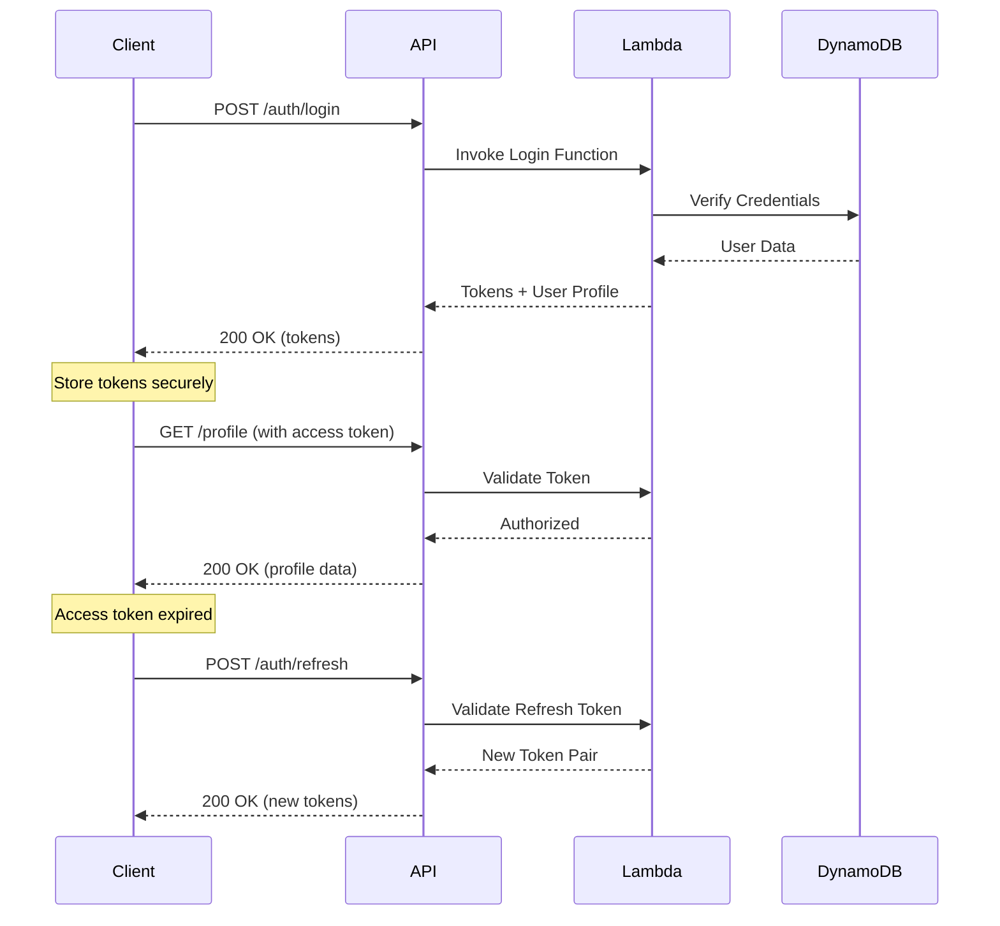

# Social Media Application - API Reference

## Table of Contents

1. [Overview](#overview)
2. [Base Configuration](#base-configuration)
3. [Authentication](#authentication)
4. [Error Handling](#error-handling)
5. [Authentication Endpoints](#authentication-endpoints)
6. [Profile Endpoints](#profile-endpoints)
7. [Post Endpoints](#post-endpoints)
8. [Data Models](#data-models)
9. [Testing the API](#testing-the-api)

---

## Overview

The Social Media Application API is a RESTful service built on AWS API Gateway HTTP API with Lambda function integrations. All endpoints return JSON responses and require JSON request bodies where applicable.

### API Version
- **Current Version**: 1.0.0
- **Base URL Development**: `https://{api-id}.execute-api.{region}.amazonaws.com/`
- **Base URL Production**: `https://api.yourdomain.com/` (when configured)

### Key Features
- JWT-based authentication with refresh tokens
- Comprehensive input validation using Zod schemas
- CORS support for web applications
- Consistent error responses
- Request correlation tracking

---

## Base Configuration

### Request Headers

#### Required Headers
```http
Content-Type: application/json
```

#### Authentication Headers
```http
Authorization: Bearer {access_token}
```

#### Optional Headers
```http
X-Correlation-Id: {uuid}  # For request tracking
Accept: application/json
```

### Response Headers

All responses include:
```http
Content-Type: application/json
Access-Control-Allow-Origin: *  # Or specific origin in production
X-Correlation-Id: {request-id}
```

### Rate Limiting

Currently no rate limiting is implemented. Future versions will include:
- 100 requests per minute for authenticated users
- 20 requests per minute for unauthenticated users
- 1000 requests per hour per IP address

---

## Authentication

The API uses JWT (JSON Web Tokens) for authentication with a dual-token system:

### Token Types

#### Access Token
- **Purpose**: API authentication
- **Expiry**: 15 minutes
- **Storage**: Memory or sessionStorage (recommended)
- **Usage**: Include in Authorization header

#### Refresh Token
- **Purpose**: Generate new access tokens
- **Expiry**: 30 days
- **Storage**: Secure httpOnly cookie (recommended) or secure storage
- **Usage**: Send to /auth/refresh endpoint

### Authentication Flow



---

## Error Handling

### Error Response Format

All errors follow a consistent structure:

```json
{
  "error": {
    "code": "ERROR_CODE",
    "message": "Human-readable error description",
    "details": {
      // Optional: Additional context
    }
  }
}
```

### Common Error Codes

| Code | HTTP Status | Description |
|------|-------------|-------------|
| `VALIDATION_ERROR` | 400 | Request validation failed |
| `INVALID_CREDENTIALS` | 401 | Invalid email or password |
| `UNAUTHORIZED` | 401 | Missing or invalid authentication |
| `TOKEN_EXPIRED` | 401 | Access token has expired |
| `FORBIDDEN` | 403 | Insufficient permissions |
| `NOT_FOUND` | 404 | Resource not found |
| `CONFLICT` | 409 | Resource already exists |
| `INTERNAL_ERROR` | 500 | Internal server error |

### Validation Error Details

For validation errors, the response includes field-specific errors:

```json
{
  "error": {
    "code": "VALIDATION_ERROR",
    "message": "Request validation failed",
    "details": {
      "errors": [
        {
          "field": "email",
          "message": "Invalid email format"
        },
        {
          "field": "password",
          "message": "Password must be at least 8 characters"
        }
      ]
    }
  }
}
```

---

## Authentication Endpoints

### Register User

Create a new user account.

**Endpoint:** `POST /auth/register`

**Authentication:** Not required

**Request Body:**
```json
{
  "email": "user@example.com",
  "password": "SecurePass123!",
  "username": "johndoe",
  "fullName": "John Doe"  // Optional
}
```

**Validation Rules:**
- Email: Valid email format, max 255 characters
- Password: Min 8 chars, must contain uppercase, lowercase, number, and special character
- Username: 3-30 chars, alphanumeric and underscores only
- Full Name: Optional, max 100 characters

**Success Response (201):**
```json
{
  "user": {
    "id": "550e8400-e29b-41d4-a716-446655440000",
    "email": "user@example.com",
    "username": "johndoe",
    "fullName": "John Doe",
    "emailVerified": false,
    "createdAt": "2024-01-15T10:30:00.000Z"
  },
  "message": "User registered successfully. Please check your email for verification."
}
```

**Error Responses:**
- 400: Validation error (invalid input)
- 409: Email or username already exists

**Example cURL:**
```bash
curl -X POST https://api.example.com/auth/register \
  -H "Content-Type: application/json" \
  -d '{
    "email": "user@example.com",
    "password": "SecurePass123!",
    "username": "johndoe",
    "fullName": "John Doe"
  }'
```

---

### Login

Authenticate user and receive tokens.

**Endpoint:** `POST /auth/login`

**Authentication:** Not required

**Request Body:**
```json
{
  "email": "user@example.com",
  "password": "SecurePass123!",
  "deviceInfo": {  // Optional
    "userAgent": "Mozilla/5.0...",
    "platform": "web"
  }
}
```

**Success Response (200):**
```json
{
  "user": {
    "id": "550e8400-e29b-41d4-a716-446655440000",
    "email": "user@example.com",
    "username": "johndoe",
    "fullName": "John Doe",
    "bio": "Software developer",
    "avatarUrl": "https://cdn.example.com/avatars/user123.jpg",
    "emailVerified": true
  },
  "tokens": {
    "accessToken": "eyJhbGciOiJIUzI1NiIs...",
    "refreshToken": "eyJhbGciOiJIUzI1NiIs...",
    "expiresIn": 900
  }
}
```

**Error Responses:**
- 400: Validation error
- 401: Invalid credentials
- 429: Too many login attempts (future)

**Example cURL:**
```bash
curl -X POST https://api.example.com/auth/login \
  -H "Content-Type: application/json" \
  -d '{
    "email": "user@example.com",
    "password": "SecurePass123!"
  }'
```

---

### Refresh Token

Exchange refresh token for new token pair.

**Endpoint:** `POST /auth/refresh`

**Authentication:** Not required (uses refresh token)

**Request Body:**
```json
{
  "refreshToken": "eyJhbGciOiJIUzI1NiIs..."
}
```

**Success Response (200):**
```json
{
  "tokens": {
    "accessToken": "eyJhbGciOiJIUzI1NiIs...",
    "refreshToken": "eyJhbGciOiJIUzI1NiIs...",
    "expiresIn": 900
  }
}
```

**Error Responses:**
- 400: Invalid request
- 401: Invalid or expired refresh token

**Example cURL:**
```bash
curl -X POST https://api.example.com/auth/refresh \
  -H "Content-Type: application/json" \
  -d '{
    "refreshToken": "eyJhbGciOiJIUzI1NiIs..."
  }'
```

---

### Logout

Invalidate user session and refresh token.

**Endpoint:** `POST /auth/logout`

**Authentication:** Required

**Request Body:**
```json
{
  "refreshToken": "eyJhbGciOiJIUzI1NiIs..."
}
```

**Success Response (200):**
```json
{
  "success": true,
  "message": "Logged out successfully"
}
```

**Error Responses:**
- 401: Unauthorized

**Example cURL:**
```bash
curl -X POST https://api.example.com/auth/logout \
  -H "Authorization: Bearer {access_token}" \
  -H "Content-Type: application/json" \
  -d '{
    "refreshToken": "eyJhbGciOiJIUzI1NiIs..."
  }'
```

---

### Get Current User Profile

Retrieve authenticated user's profile.

**Endpoint:** `GET /auth/profile`

**Authentication:** Required

**Success Response (200):**
```json
{
  "user": {
    "id": "550e8400-e29b-41d4-a716-446655440000",
    "email": "user@example.com",
    "username": "johndoe",
    "fullName": "John Doe",
    "bio": "Software developer passionate about clean code",
    "avatarUrl": "https://cdn.example.com/avatars/user123.jpg",
    "emailVerified": true,
    "createdAt": "2024-01-15T10:30:00.000Z",
    "updatedAt": "2024-01-20T15:45:00.000Z"
  }
}
```

**Error Responses:**
- 401: Unauthorized
- 404: User not found

**Example cURL:**
```bash
curl -X GET https://api.example.com/auth/profile \
  -H "Authorization: Bearer {access_token}"
```

---

### Update Current User Profile

Update authenticated user's profile information.

**Endpoint:** `PUT /auth/profile`

**Authentication:** Required

**Request Body:**
```json
{
  "fullName": "John Smith",
  "bio": "Full-stack developer | React | AWS",
  "avatarUrl": "https://cdn.example.com/avatars/new-avatar.jpg"
}
```

**Validation Rules:**
- Full Name: Optional, max 100 characters
- Bio: Optional, max 500 characters
- Avatar URL: Optional, valid URL format

**Success Response (200):**
```json
{
  "user": {
    "id": "550e8400-e29b-41d4-a716-446655440000",
    "email": "user@example.com",
    "username": "johndoe",
    "fullName": "John Smith",
    "bio": "Full-stack developer | React | AWS",
    "avatarUrl": "https://cdn.example.com/avatars/new-avatar.jpg",
    "emailVerified": true,
    "createdAt": "2024-01-15T10:30:00.000Z",
    "updatedAt": "2024-01-25T12:00:00.000Z"
  }
}
```

**Error Responses:**
- 400: Validation error
- 401: Unauthorized

**Example cURL:**
```bash
curl -X PUT https://api.example.com/auth/profile \
  -H "Authorization: Bearer {access_token}" \
  -H "Content-Type: application/json" \
  -d '{
    "fullName": "John Smith",
    "bio": "Full-stack developer | React | AWS"
  }'
```

---

## Profile Endpoints

### Get Profile by Handle

Retrieve public profile by handle.

**Endpoint:** `GET /profile/{handle}`

**Authentication:** Optional (returns more data if authenticated)

**Path Parameters:**
- `handle`: User's unique handle (3-30 chars, alphanumeric, underscores, hyphens)

**Success Response (200):**
```json
{
  "profile": {
    "id": "550e8400-e29b-41d4-a716-446655440000",
    "handle": "johndoe",
    "username": "johndoe",
    "fullName": "John Doe",
    "bio": "Software developer passionate about clean code",
    "profilePictureUrl": "https://cdn.example.com/profiles/johndoe.jpg",
    "profilePictureThumbnailUrl": "https://cdn.example.com/profiles/johndoe-thumb.jpg",
    "postsCount": 42,
    "followersCount": 150,
    "followingCount": 75,
    "createdAt": "2024-01-15T10:30:00.000Z"
  }
}
```

**Error Responses:**
- 404: Profile not found

**Example cURL:**
```bash
curl -X GET https://api.example.com/profile/johndoe
```

---

### Update Profile

Update authenticated user's extended profile.

**Endpoint:** `PUT /profile`

**Authentication:** Required

**Request Body:**
```json
{
  "handle": "johndoe_dev",  // Optional, must be unique
  "bio": "Senior Full-stack Developer",
  "fullName": "John Doe"
}
```

**Validation Rules:**
- Handle: 3-30 chars, alphanumeric, underscores, hyphens (must be unique)
- Bio: Max 500 characters
- Full Name: Max 100 characters

**Success Response (200):**
```json
{
  "profile": {
    "id": "550e8400-e29b-41d4-a716-446655440000",
    "handle": "johndoe_dev",
    "username": "johndoe",
    "fullName": "John Doe",
    "bio": "Senior Full-stack Developer",
    "profilePictureUrl": "https://cdn.example.com/profiles/johndoe.jpg",
    "profilePictureThumbnailUrl": "https://cdn.example.com/profiles/johndoe-thumb.jpg",
    "postsCount": 42,
    "followersCount": 150,
    "followingCount": 75,
    "email": "user@example.com",
    "emailVerified": true,
    "createdAt": "2024-01-15T10:30:00.000Z",
    "updatedAt": "2024-01-25T14:30:00.000Z"
  },
  "message": "Profile updated successfully"
}
```

**Error Responses:**
- 400: Validation error
- 401: Unauthorized
- 409: Handle already taken

**Example cURL:**
```bash
curl -X PUT https://api.example.com/profile \
  -H "Authorization: Bearer {access_token}" \
  -H "Content-Type: application/json" \
  -d '{
    "handle": "johndoe_dev",
    "bio": "Senior Full-stack Developer"
  }'
```

---

### Get Upload URL

Generate presigned URLs for media uploads.

**Endpoint:** `POST /profile/upload-url`

**Authentication:** Required

**Request Body:**
```json
{
  "fileType": "profile-picture",  // or "post-image"
  "contentType": "image/jpeg"     // MIME type
}
```

**Validation Rules:**
- File Type: Must be one of: "profile-picture", "post-image"
- Content Type: Must be valid MIME type (image/jpeg, image/png, image/gif, image/webp)

**Success Response (200):**
```json
{
  "uploadUrl": "https://s3.amazonaws.com/bucket/path?X-Amz-Signature=...",
  "thumbnailUploadUrl": "https://s3.amazonaws.com/bucket/thumb/path?X-Amz-Signature=...",
  "imageUrl": "https://cdn.example.com/images/550e8400.jpg",
  "thumbnailUrl": "https://cdn.example.com/thumbnails/550e8400.jpg",
  "expiresIn": 300
}
```

**Error Responses:**
- 400: Invalid file type or content type
- 401: Unauthorized

**Example cURL:**
```bash
curl -X POST https://api.example.com/profile/upload-url \
  -H "Authorization: Bearer {access_token}" \
  -H "Content-Type: application/json" \
  -d '{
    "fileType": "profile-picture",
    "contentType": "image/jpeg"
  }'
```

**Upload Process:**
1. Request presigned URL from this endpoint
2. Upload file directly to S3 using the presigned URL
3. Use returned imageUrl in profile/post update

```bash
# Step 2: Upload to S3
curl -X PUT "{uploadUrl}" \
  -H "Content-Type: image/jpeg" \
  --data-binary @profile-picture.jpg
```

---

## Post Endpoints

### Create Post

Create a new post with image.

**Endpoint:** `POST /posts`

**Authentication:** Required

**Request Body:**
```json
{
  "caption": "Beautiful sunset at the beach #sunset #beach",
  "tags": ["sunset", "beach", "nature"],
  "isPublic": true
}
```

**Validation Rules:**
- Caption: Optional, max 2000 characters
- Tags: Optional array, max 10 tags, each max 50 characters
- Is Public: Optional boolean, defaults to true

**Success Response (201):**
```json
{
  "post": {
    "id": "660e8400-e29b-41d4-a716-446655440001",
    "userId": "550e8400-e29b-41d4-a716-446655440000",
    "userHandle": "johndoe",
    "imageUrl": "https://cdn.example.com/posts/660e8400.jpg",
    "thumbnailUrl": "https://cdn.example.com/posts/660e8400-thumb.jpg",
    "caption": "Beautiful sunset at the beach #sunset #beach",
    "tags": ["sunset", "beach", "nature"],
    "likesCount": 0,
    "commentsCount": 0,
    "isPublic": true,
    "createdAt": "2024-01-25T18:30:00.000Z",
    "updatedAt": "2024-01-25T18:30:00.000Z"
  },
  "uploadUrl": "https://s3.amazonaws.com/bucket/posts/660e8400.jpg?X-Amz-Signature=...",
  "thumbnailUploadUrl": "https://s3.amazonaws.com/bucket/posts/660e8400-thumb.jpg?X-Amz-Signature=..."
}
```

**Error Responses:**
- 400: Validation error
- 401: Unauthorized

**Example cURL:**
```bash
curl -X POST https://api.example.com/posts \
  -H "Authorization: Bearer {access_token}" \
  -H "Content-Type: application/json" \
  -d '{
    "caption": "Beautiful sunset at the beach #sunset #beach",
    "tags": ["sunset", "beach"],
    "isPublic": true
  }'
```

---

### Get User Posts

Get posts by user handle with pagination.

**Endpoint:** `GET /profile/{handle}/posts`

**Authentication:** Optional (private posts visible only to owner)

**Path Parameters:**
- `handle`: User's handle

**Query Parameters:**
- `limit`: Number of posts to return (1-100, default: 20)
- `cursor`: Pagination cursor from previous response
- `sortBy`: Sort order ("createdAt" | "likesCount", default: "createdAt")
- `order`: Sort direction ("asc" | "desc", default: "desc")

**Success Response (200):**
```json
{
  "posts": [
    {
      "id": "660e8400-e29b-41d4-a716-446655440001",
      "thumbnailUrl": "https://cdn.example.com/posts/660e8400-thumb.jpg",
      "caption": "Beautiful sunset at the beach",
      "likesCount": 42,
      "commentsCount": 5,
      "createdAt": "2024-01-25T18:30:00.000Z"
    },
    {
      "id": "660e8400-e29b-41d4-a716-446655440002",
      "thumbnailUrl": "https://cdn.example.com/posts/660e8400-thumb-2.jpg",
      "caption": "Mountain hiking adventure",
      "likesCount": 38,
      "commentsCount": 3,
      "createdAt": "2024-01-24T14:20:00.000Z"
    }
  ],
  "totalCount": 42,
  "hasMore": true,
  "nextCursor": "eyJjcmVhdGVkQXQiOiIyMDI0LTAxLTI0VDE0OjIwOjAwLjAwMFoifQ=="
}
```

**Error Responses:**
- 404: User not found

**Example cURL:**
```bash
curl -X GET "https://api.example.com/profile/johndoe/posts?limit=10&sortBy=likesCount&order=desc"
```

---

### Delete Post

Delete a post (soft delete).

**Endpoint:** `DELETE /posts/{postId}`

**Authentication:** Required (must be post owner)

**Path Parameters:**
- `postId`: Post UUID

**Success Response (200):**
```json
{
  "success": true,
  "message": "Post deleted successfully"
}
```

**Error Responses:**
- 401: Unauthorized
- 403: Not post owner
- 404: Post not found

**Example cURL:**
```bash
curl -X DELETE https://api.example.com/posts/660e8400-e29b-41d4-a716-446655440001 \
  -H "Authorization: Bearer {access_token}"
```

---

## Data Models

### User Model
```typescript
interface User {
  id: string;                    // UUID v4
  email: string;                 // Unique email
  username: string;              // Unique username
  passwordHash: string;          // Bcrypt hash (never exposed in API)
  fullName?: string;             // Optional display name
  bio?: string;                  // User biography
  avatarUrl?: string;            // Avatar image URL
  emailVerified: boolean;        // Email verification status
  createdAt: string;             // ISO 8601 timestamp
  updatedAt: string;             // ISO 8601 timestamp
}
```

### Profile Model
```typescript
interface Profile extends User {
  handle: string;                // Unique handle
  profilePictureUrl?: string;    // Full-size profile image
  profilePictureThumbnailUrl?: string; // Thumbnail version
  postsCount: number;            // Total posts
  followersCount: number;        // Total followers
  followingCount: number;        // Total following
}
```

### Post Model
```typescript
interface Post {
  id: string;                    // UUID v4
  userId: string;                // Owner's user ID
  userHandle: string;            // Owner's handle
  imageUrl: string;              // Full-size image URL
  thumbnailUrl: string;          // Thumbnail URL
  caption?: string;              // Post caption
  tags: string[];                // Hashtags
  likesCount: number;            // Total likes
  commentsCount: number;         // Total comments
  isPublic: boolean;             // Visibility flag
  createdAt: string;             // ISO 8601 timestamp
  updatedAt: string;             // ISO 8601 timestamp
}
```

### Token Payload
```typescript
interface AccessTokenPayload {
  sub: string;                   // User ID
  email: string;                 // User email
  username: string;              // Username
  iat: number;                   // Issued at (Unix timestamp)
  exp: number;                   // Expires at (Unix timestamp)
}

interface RefreshTokenPayload {
  sub: string;                   // User ID
  sessionId: string;             // Session ID
  iat: number;                   // Issued at
  exp: number;                   // Expires at
}
```

---

## Testing the API

### Using cURL

Basic authenticated request:
```bash
# 1. Login to get tokens
TOKEN=$(curl -s -X POST https://api.example.com/auth/login \
  -H "Content-Type: application/json" \
  -d '{"email":"test@example.com","password":"Test123!"}' \
  | jq -r '.tokens.accessToken')

# 2. Use token in subsequent requests
curl -X GET https://api.example.com/auth/profile \
  -H "Authorization: Bearer $TOKEN"
```

### Using Postman

1. Import the API collection (available in `/docs/postman-collection.json`)
2. Set environment variables:
   - `api_url`: Your API Gateway URL
   - `access_token`: Token from login response
3. Run requests from the collection

### Using JavaScript/TypeScript

```typescript
// Using the provided API client
import { apiClient } from '@social-media-app/frontend/services/apiClient';

// Login
const loginResponse = await apiClient.auth.login({
  email: 'user@example.com',
  password: 'SecurePass123!'
});

// Set token
apiClient.setAccessToken(loginResponse.tokens.accessToken);

// Make authenticated requests
const profile = await apiClient.auth.getProfile();
const posts = await apiClient.posts.getUserPosts('johndoe');
```

### Testing Webhooks (Future)

Webhooks will be implemented for:
- Email verification
- Password reset
- New follower notifications
- Post interactions

Webhook payload format:
```json
{
  "event": "user.verified",
  "timestamp": "2024-01-25T10:30:00.000Z",
  "data": {
    "userId": "550e8400-e29b-41d4-a716-446655440000",
    "email": "user@example.com"
  },
  "signature": "sha256=..."
}
```

---

## API Versioning

The API follows semantic versioning (SemVer):

- **Major version**: Breaking changes (URL path: `/v2/`)
- **Minor version**: New features, backwards compatible
- **Patch version**: Bug fixes

Current version: `1.0.0`

### Deprecation Policy

1. Deprecated features marked with `Deprecation` header
2. Minimum 6 months notice before removal
3. Migration guide provided for breaking changes

### Version History

| Version | Date | Changes |
|---------|------|---------|
| 1.0.0 | 2024-01-25 | Initial release |

---

## Rate Limiting (Future)

Rate limits will be implemented per endpoint:

| Endpoint | Authenticated | Unauthenticated |
|----------|--------------|-----------------|
| POST /auth/login | - | 5/minute |
| POST /auth/register | - | 3/minute |
| POST /auth/refresh | 10/minute | - |
| GET /profile/* | 100/minute | 20/minute |
| POST /posts | 10/minute | - |
| DELETE /posts/* | 20/minute | - |

Headers in response:
```http
X-RateLimit-Limit: 100
X-RateLimit-Remaining: 95
X-RateLimit-Reset: 1706186400
```

---

## SDK Support

### Official SDKs (Planned)

- JavaScript/TypeScript (available)
- Python (planned)
- Go (planned)
- Java (planned)

### Community SDKs

Contributions welcome! See [CONTRIBUTING.md](./CONTRIBUTING.md)

---

## OpenAPI Specification

The complete OpenAPI 3.0 specification is available at:
- Development: `https://api.example.com/openapi.json`
- [Local file](./docs/openapi.yaml)

### Generating Client Code

Using OpenAPI Generator:
```bash
# TypeScript client
openapi-generator-cli generate \
  -i openapi.yaml \
  -g typescript-axios \
  -o ./generated/typescript-client

# Python client
openapi-generator-cli generate \
  -i openapi.yaml \
  -g python \
  -o ./generated/python-client
```

---

## Webhooks and Events (Future)

### Event Types

| Event | Description | Payload |
|-------|-------------|---------|
| `user.registered` | New user registration | User data |
| `user.verified` | Email verified | User ID |
| `post.created` | New post created | Post data |
| `post.deleted` | Post deleted | Post ID |
| `follow.created` | New follower | Follower/Following IDs |

### Webhook Security

1. HMAC-SHA256 signature verification
2. Timestamp validation (5-minute window)
3. Replay attack prevention with nonce

---

## Support

For API support:
- GitHub Issues: [github.com/your-org/social-media-app/issues](https://github.com/your-org/social-media-app/issues)
- Email: api-support@example.com
- Documentation: [docs.example.com](https://docs.example.com)

---

*API Reference Version 1.0.0 - Last Updated: January 2024*