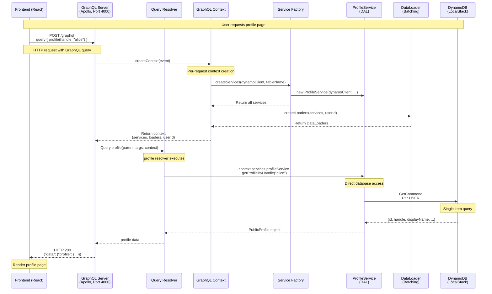
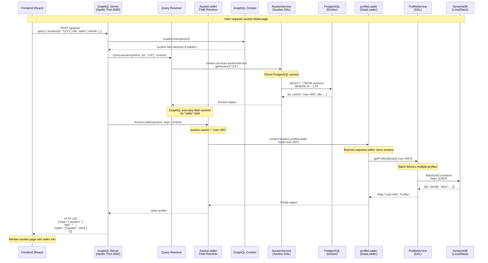
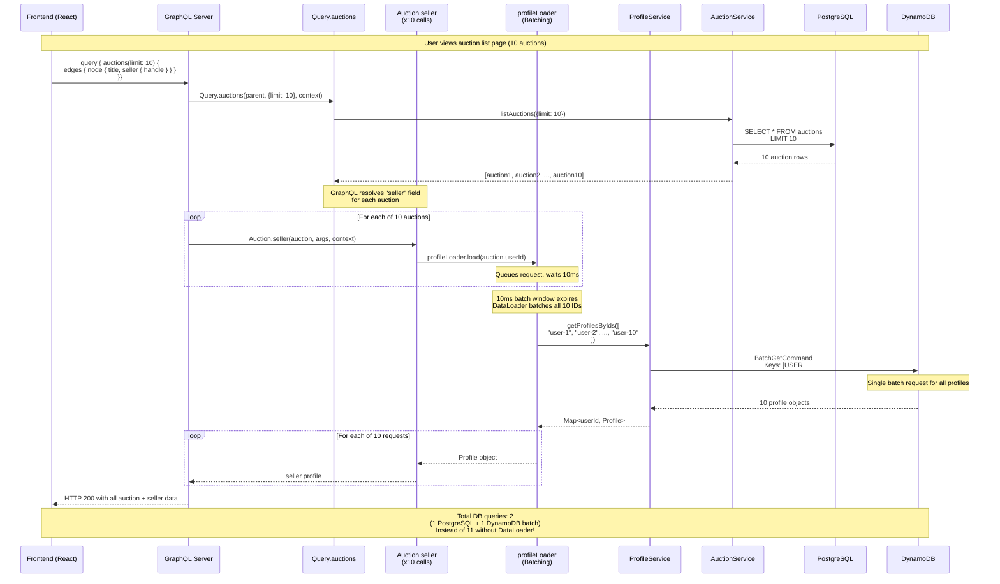

# Architecture Flow Diagram - End-to-End Request

**Date:** October 16, 2025

---

## Sequence Diagram: Get Profile Request



---

## Sequence Diagram: Get Auction with Seller Profile (N+1 Prevention)



---

## Sequence Diagram: List Auctions with Sellers (DataLoader Batching)



---

## Architecture Layers

```
┌─────────────────────────────────────────────────────────────┐
│                    FRONTEND (React)                         │
│  • UI Components                                            │
│  • GraphQL Client (graphql-request)                         │
│  • State Management (React hooks)                           │
└─────────────────────┬───────────────────────────────────────┘
                      │ HTTP POST /graphql
                      │ GraphQL queries/mutations
                      ▼
┌─────────────────────────────────────────────────────────────┐
│              GRAPHQL SERVER (Apollo Server v4)              │
│  • Schema (typeDefs)                                        │
│  • Resolvers (Query, Mutation, Field)                      │
│  • Context (services, loaders, userId)                     │
│  • DataLoaders (batching & caching)                        │
└─────────────┬───────────────────┬───────────────────────────┘
              │                   │
              │ Call methods      │ Call methods
              ▼                   ▼
┌──────────────────────┐  ┌──────────────────────┐
│   DAL (DynamoDB)     │  │ Auction DAL (PG)     │
│  • ProfileService    │  │  • AuctionService    │
│  • PostService       │  │  • ACID transactions │
│  • LikeService       │  │  • Row locking       │
│  • FollowService     │  │                      │
│  • CommentService    │  │                      │
│  • FeedService       │  │                      │
│  • NotificationSvc   │  │                      │
└──────────┬───────────┘  └──────────┬───────────┘
           │                         │
           │ AWS SDK commands        │ pg library (SQL)
           ▼                         ▼
┌──────────────────────┐  ┌──────────────────────┐
│   DynamoDB           │  │   PostgreSQL         │
│  (LocalStack)        │  │   (Docker)           │
│  • Single table      │  │  • auctions table    │
│  • GSI indexes       │  │  • bids table        │
│  • Eventual consist. │  │  • ACID guarantees   │
└──────────────────────┘  └──────────────────────┘
```

---

## Key Architectural Patterns

### 1. GraphQL Context (Dependency Injection)

**Created once per request:**
```typescript
context = {
  userId: string | null,           // From JWT token
  dynamoClient: DynamoDBClient,    // AWS SDK client
  tableName: string,               // DynamoDB table
  services: {                      // ALL DAL services
    profileService,
    postService,
    auctionService,  // ← Added for auctions
    // ... 8 services total
  },
  loaders: {                       // DataLoaders for N+1 prevention
    profileLoader,
    postLoader,
    auctionLoader,   // ← Added for auctions
    likeStatusLoader
  }
}
```

### 2. Service Factory Pattern

**Single instantiation point:**
```typescript
function createServices(dynamoClient, tableName) {
  // DynamoDB services
  const profileService = new ProfileService(dynamoClient, tableName);
  const postService = new PostService(dynamoClient, tableName, profileService);

  // PostgreSQL service
  const pgPool = createPostgresPool();
  const auctionService = new AuctionService(pgPool);

  return { profileService, postService, auctionService, ... };
}
```

**Eliminates ~400 lines of duplicated service instantiation code!**

### 3. DataLoader Pattern (N+1 Prevention)

**Without DataLoader (N+1 problem):**
```
Query: Load 10 auctions        → 1 database query
Load seller for auction 1      → 1 database query
Load seller for auction 2      → 1 database query
...
Load seller for auction 10     → 1 database query
Total: 11 queries
```

**With DataLoader (batched):**
```
Query: Load 10 auctions        → 1 database query
DataLoader batches all sellers → 1 database query (batch)
Total: 2 queries (5.5x improvement!)
```

### 4. Resolver Types

**Query Resolvers (root level):**
```typescript
Query.profile(parent, { handle }, context)
Query.auction(parent, { id }, context)
Query.auctions(parent, { limit, status }, context)
```

**Field Resolvers (nested data):**
```typescript
Auction.seller(auction, args, context)
  → return context.loaders.profileLoader.load(auction.userId)

Post.author(post, args, context)
  → return context.loaders.profileLoader.load(post.userId)
```

**Mutation Resolvers (write operations):**
```typescript
Mutation.createAuction(parent, { input }, context)
Mutation.placeBid(parent, { input }, context)
```

---

## Request Flow Summary

### Simple Request (Profile)
1. **Frontend**: GraphQL query → Apollo Client
2. **GraphQL Server**: Parse query → Execute resolver
3. **Resolver**: Call `ProfileService.getProfileByHandle()`
4. **DAL**: Execute DynamoDB GetCommand
5. **Database**: Return profile data
6. **Response**: GraphQL formats & returns JSON

### Complex Request (Auction + Seller)
1. **Frontend**: GraphQL query with nested fields
2. **GraphQL Server**: Execute Query.auction resolver
3. **Query Resolver**: Call `AuctionService.getAuction()` → PostgreSQL
4. **GraphQL**: Execute field resolver Auction.seller
5. **Field Resolver**: Call `profileLoader.load(userId)`
6. **DataLoader**: Batch multiple profile requests (10ms window)
7. **DAL**: Single batch query to DynamoDB
8. **Response**: GraphQL returns auction with seller data

### Batched Request (10 Auctions)
1. **Query Resolver**: Load 10 auctions from PostgreSQL
2. **Field Resolvers**: 10 calls to Auction.seller
3. **DataLoader**: Queues 10 profile IDs, waits 10ms
4. **DataLoader**: Batches into single `getProfilesByIds([...10 IDs])`
5. **DAL**: Single BatchGetCommand to DynamoDB
6. **Result**: 2 database queries instead of 11!

---

## Why This Architecture Works

### ✅ Separation of Concerns
- **Frontend**: UI/UX, user interactions
- **GraphQL**: API gateway, data fetching orchestration
- **DAL**: Database access, business logic
- **Database**: Data persistence

### ✅ Performance Optimization
- **DataLoaders**: Eliminate N+1 queries automatically
- **Batching**: Group multiple requests into single DB call
- **Caching**: Per-request cache prevents duplicate fetches

### ✅ Type Safety
- **GraphQL Schema**: API contract
- **TypeScript**: End-to-end type checking
- **Zod**: Runtime validation in DAL

### ✅ Flexibility
- **GraphQL**: Clients request exactly what they need
- **No over-fetching**: Frontend controls data shape
- **No under-fetching**: Single query gets all related data

### ✅ Scalability
- **Hybrid databases**: PostgreSQL for ACID, DynamoDB for scale
- **Connection pooling**: Efficient resource usage
- **Stateless resolvers**: Horizontal scaling

---

## What's Different: Auctions vs Posts

### Posts (DynamoDB)
```
Frontend → GraphQL → PostService → DynamoDB
         ↓
    Eventually consistent
    High throughput
    NoSQL queries
```

### Auctions (PostgreSQL)
```
Frontend → GraphQL → AuctionService → PostgreSQL
         ↓
    ACID transactions
    Row-level locking
    SQL queries
```

### Both Use Same Patterns!
- ✅ Service factory (context.services)
- ✅ DataLoader (context.loaders)
- ✅ GraphQL resolvers
- ✅ Field resolvers for related data

**The only difference is which database the DAL talks to!**
