# DynamoDB Single-Table Design: Deep Dive Analysis

**Project:** TamaFriends Social Media Application
**Date:** October 2025
**Version:** 1.0

---

## Table of Contents

1. [Executive Summary](#executive-summary)
2. [Cursor-Based Pagination Architecture](#cursor-based-pagination-architecture)
3. [Single-Table Design Overview](#single-table-design-overview)
4. [Entity Structures and Access Patterns](#entity-structures-and-access-patterns)
5. [Data Duplication Patterns](#data-duplication-patterns)
6. [Stream Processing and Synchronization](#stream-processing-and-synchronization)
7. [Feed Architecture](#feed-architecture)
8. [Storage Analysis and Cost Implications](#storage-analysis-and-cost-implications)
9. [Best Practices and Recommendations](#best-practices-and-recommendations)

---

## Executive Summary

This document provides a comprehensive analysis of the DynamoDB single-table design pattern implementation in the TamaFriends social media application. It covers:

- **Cursor-based pagination**: Opaque token approach using DynamoDB's native `LastEvaluatedKey`
- **GSI strategy**: Three Global Secondary Indexes for efficient access patterns
- **Data duplication**: Denormalized counters, embedded metadata, and snapshot fields
- **Stream processing**: Event-driven counter synchronization
- **Storage implications**: 1.7× canonical size with negligible cost impact

**Key Finding:** The current design is well-optimized for DynamoDB with acceptable tradeoffs between performance, consistency, and storage overhead.

---

## Cursor-Based Pagination Architecture

### Current Implementation

The application uses **opaque cursor-based pagination** with DynamoDB's native pagination mechanism.

```typescript
// Encoding cursor
const nextCursor = result.LastEvaluatedKey
  ? Buffer.from(JSON.stringify(result.LastEvaluatedKey)).toString('base64')
  : undefined;

// Decoding cursor
if (options?.cursor) {
  query.ExclusiveStartKey = JSON.parse(
    Buffer.from(options.cursor, 'base64').toString()
  );
}
```

### Cursor Flow Diagram

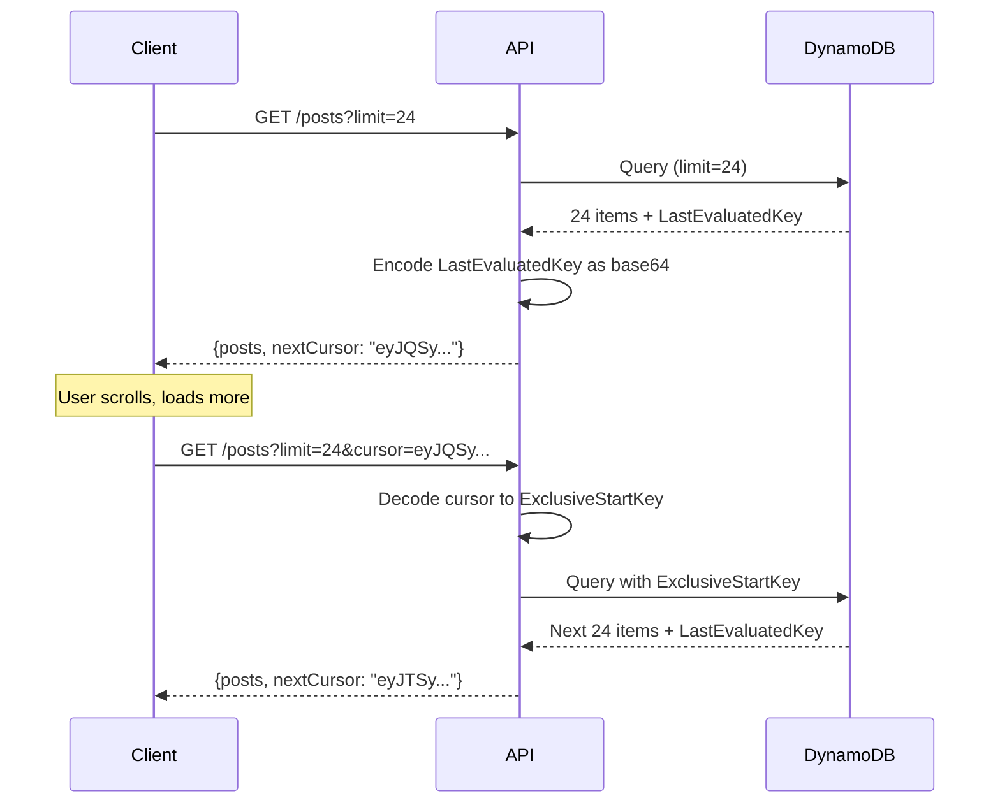
```mermaid
sequenceDiagram
    participant Client
    participant API
    participant DynamoDB

    Client->>API: GET /posts?limit=24
    API->>DynamoDB: Query (limit=24)
    DynamoDB-->>API: 24 items + LastEvaluatedKey
    API->>API: Encode LastEvaluatedKey as base64
    API-->>Client: {posts, nextCursor: "eyJQSy..."}

    Note over Client: User scrolls, loads more

    Client->>API: GET /posts?limit=24&cursor=eyJQSy...
    API->>API: Decode cursor to ExclusiveStartKey
    API->>DynamoDB: Query with ExclusiveStartKey
    DynamoDB-->>API: Next 24 items + LastEvaluatedKey
    API-->>Client: {posts, nextCursor: "eyJTSy..."}
```

### Cursor Contents

**Decoded cursor example:**
```json
{
  "PK": "USER#550e8400-e29b-41d4-a716-446655440000",
  "SK": "POST#2024-10-12T10:30:00.000Z#660e8400-e29b-41d4-a716-446655440001"
}
```

**Encoded cursor:**
```
eyJQSyI6IlVTRVIjNTUwZTg0MDAtZTI5Yi00MWQ0LWE3MTYtNDQ2NjU1NDQwMDAwIiwiU0siOiJQT1NUI...
```

### Pagination Approach Comparison


```mermaid
graph TB
    subgraph "Cursor-Based (Current)"
        A1[Client Request] -->|cursor token| A2[Decode to DynamoDB key]
        A2 --> A3[Query with ExclusiveStartKey]
        A3 --> A4[O1 performance]
        A4 --> A5[Return next page]
    end

    subgraph "Offset-Based (Anti-pattern)"
        B1[Client Request] -->|offset=48| B2[Scan through 48 items]
        B2 --> B3[On degradation]
        B3 --> B4[High read costs]
        B4 --> B5[Return page 3]
    end

    subgraph "Keyset (Alternative)"
        C1[Client Request] -->|timestamp| C2[Query SK < timestamp]
        C2 --> C3[Duplicate risk]
        C3 --> C4[Need timestamp + ID]
        C4 --> C5[Return next page]
    end
```

### Tradeoffs Analysis

| Aspect | Cursor-Based (Current) | Offset-Based | Keyset (Timestamp) |
|--------|------------------------|--------------|-------------------|
| **Token Size** | 150-200 bytes | ~10 bytes | ~30 bytes |
| **Performance** | O(1) constant | O(n) linear | O(1) constant |
| **DynamoDB Fit** | ⭐⭐⭐⭐⭐ Native | ⭐ Anti-pattern | ⭐⭐⭐ Works |
| **Complexity** | Low | Low | Medium |
| **Stateless** | ✅ Yes | ✅ Yes | ✅ Yes |
| **Random Access** | ❌ No | ✅ Yes | ❌ No |
| **Consistency** | ✅ Strong | ⚠️ Weak | ✅ Strong |
| **Cost (RCU)** | Low | Very High | Low |

**Recommendation:** ✅ **Keep current cursor-based approach** - optimal for DynamoDB and social media UX.

---

## Single-Table Design Overview

### High-Level Entity Relationships

```mermaid
erDiagram
    USER_PROFILE ||--o{ POST : "owns"
    USER_PROFILE ||--o{ FOLLOW : "follows/followed by"
    USER_PROFILE ||--o{ COMMENT : "creates"
    POST ||--o{ LIKE : "receives"
    POST ||--o{ COMMENT : "receives"

    USER_PROFILE {
        string PK
        string SK
        string GSI1PK
        string GSI2PK
        string GSI3PK
        int postsCount
        int followersCount
        int followingCount
    }

    POST {
        string PK
        string SK
        string GSI1PK
        int likesCount
        int commentsCount
        string userHandle
    }

    LIKE {
        string PK
        string SK
        string GSI2PK
        string postUserId
        string postSK
    }

    COMMENT {
        string PK
        string SK
        string GSI1PK
        string GSI2PK
        string postUserId
        string postSK
        string userHandle
    }

    FOLLOW {
        string PK
        string SK
        string GSI1PK
        string GSI2PK
    }
```

### Table Structure

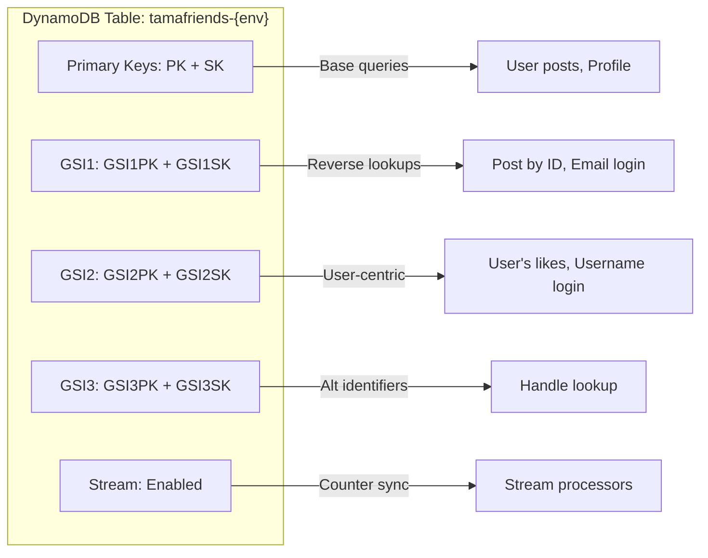
```mermaid
graph LR
    subgraph "DynamoDB Table: tamafriends-{env}"
        A[Primary Keys: PK + SK]
        B[GSI1: GSI1PK + GSI1SK]
        C[GSI2: GSI2PK + GSI2SK]
        D[GSI3: GSI3PK + GSI3SK]
        E[Stream: Enabled]
    end

    A -->|Base queries| F[User posts, Profile]
    B -->|Reverse lookups| G[Post by ID, Email login]
    C -->|User-centric| H[User's likes, Username login]
    D -->|Alt identifiers| I[Handle lookup]
    E -->|Counter sync| J[Stream processors]
```

### GSI Strategy Overview

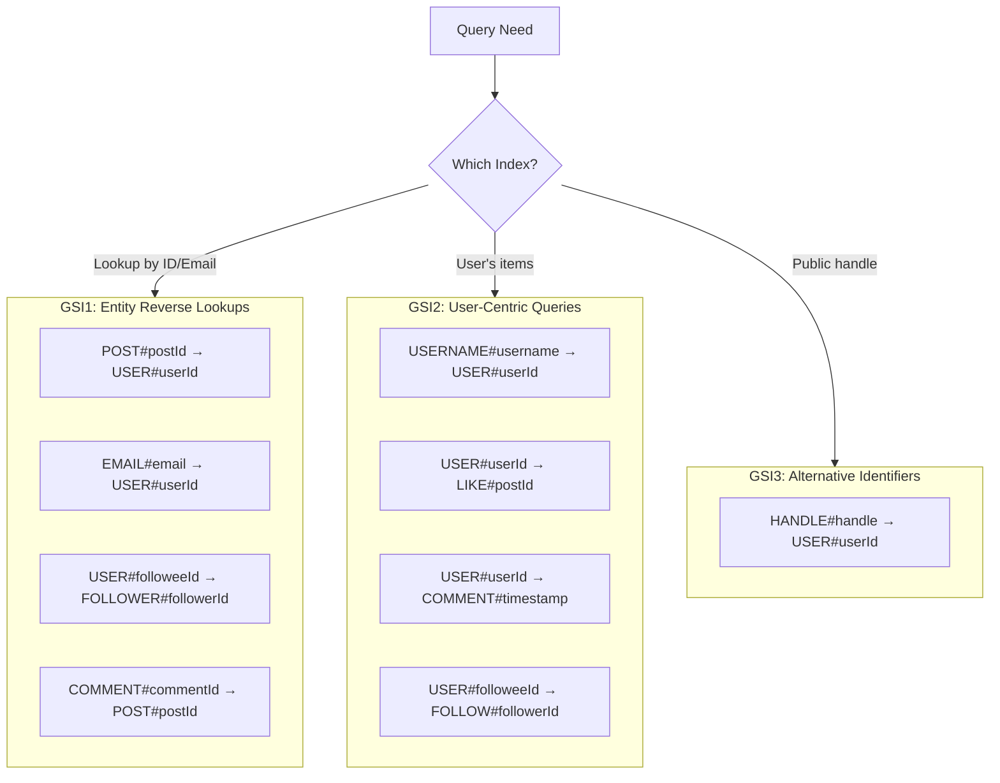
```mermaid
flowchart TB
    subgraph GSI1[GSI1: Entity Reverse Lookups]
        G1A[POST#postId → USER#userId]
        G1B[EMAIL#email → USER#userId]
        G1C[USER#followeeId → FOLLOWER#followerId]
        G1D[COMMENT#commentId → POST#postId]
    end

    subgraph GSI2[GSI2: User-Centric Queries]
        G2A[USERNAME#username → USER#userId]
        G2B[USER#userId → LIKE#postId]
        G2C[USER#userId → COMMENT#timestamp]
        G2D[USER#followeeId → FOLLOW#followerId]
    end

    subgraph GSI3[GSI3: Alternative Identifiers]
        G3A[HANDLE#handle → USER#userId]
    end

    Query[Query Need] --> Decision{Which Index?}
    Decision -->|Lookup by ID/Email| GSI1
    Decision -->|User's items| GSI2
    Decision -->|Public handle| GSI3
```

---

## Entity Structures and Access Patterns

### USER_PROFILE Entity

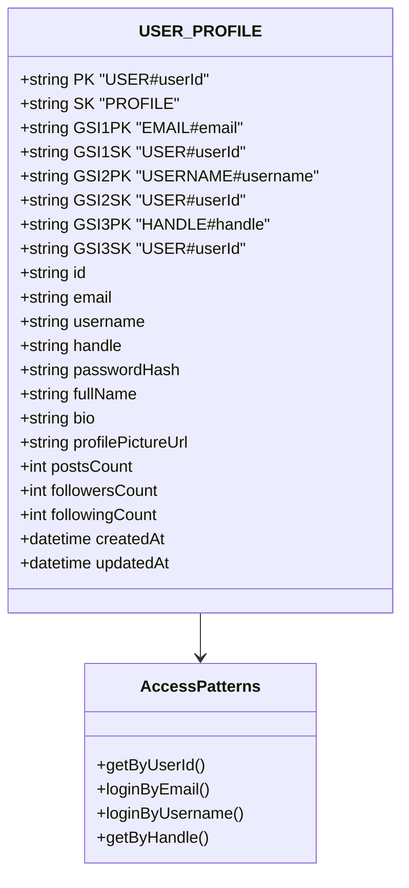
```mermaid
classDiagram
    class USER_PROFILE {
        +string PK "USER#userId"
        +string SK "PROFILE"
        +string GSI1PK "EMAIL#email"
        +string GSI1SK "USER#userId"
        +string GSI2PK "USERNAME#username"
        +string GSI2SK "USER#userId"
        +string GSI3PK "HANDLE#handle"
        +string GSI3SK "USER#userId"

        +string id
        +string email
        +string username
        +string handle
        +string passwordHash
        +string fullName
        +string bio
        +string profilePictureUrl
        +int postsCount
        +int followersCount
        +int followingCount
        +datetime createdAt
        +datetime updatedAt
    }

    class AccessPatterns {
        +getByUserId()
        +loginByEmail()
        +loginByUsername()
        +getByHandle()
    }

    USER_PROFILE --> AccessPatterns
```

**Access Pattern Flow:**

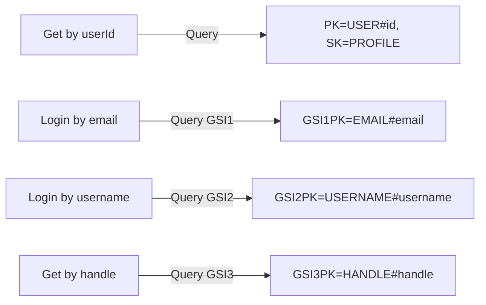
```mermaid
flowchart LR
    A[Get by userId] -->|Query| B[PK=USER#id, SK=PROFILE]
    C[Login by email] -->|Query GSI1| D[GSI1PK=EMAIL#email]
    E[Login by username] -->|Query GSI2| F[GSI2PK=USERNAME#username]
    G[Get by handle] -->|Query GSI3| H[GSI3PK=HANDLE#handle]
```

### POST Entity

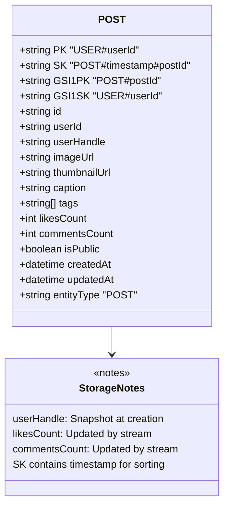
```mermaid
classDiagram
    class POST {
        +string PK "USER#userId"
        +string SK "POST#timestamp#postId"
        +string GSI1PK "POST#postId"
        +string GSI1SK "USER#userId"

        +string id
        +string userId
        +string userHandle
        +string imageUrl
        +string thumbnailUrl
        +string caption
        +string[] tags
        +int likesCount
        +int commentsCount
        +boolean isPublic
        +datetime createdAt
        +datetime updatedAt
        +string entityType "POST"
    }

    class StorageNotes {
        <<notes>>
        userHandle: Snapshot at creation
        likesCount: Updated by stream
        commentsCount: Updated by stream
        SK contains timestamp for sorting
    }

    POST --> StorageNotes
```

**Access Pattern Flow:**

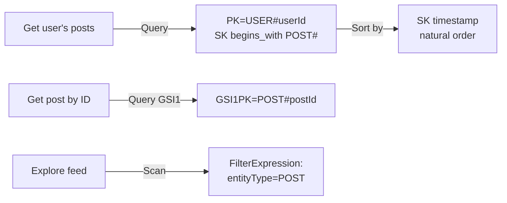
```mermaid
flowchart LR
    A[Get user's posts] -->|Query| B[PK=USER#userId<br/>SK begins_with POST#]
    C[Get post by ID] -->|Query GSI1| D[GSI1PK=POST#postId]
    E[Explore feed] -->|Scan| F[FilterExpression:<br/>entityType=POST]

    B -->|Sort by| G[SK timestamp<br/>natural order]
```

### LIKE Entity

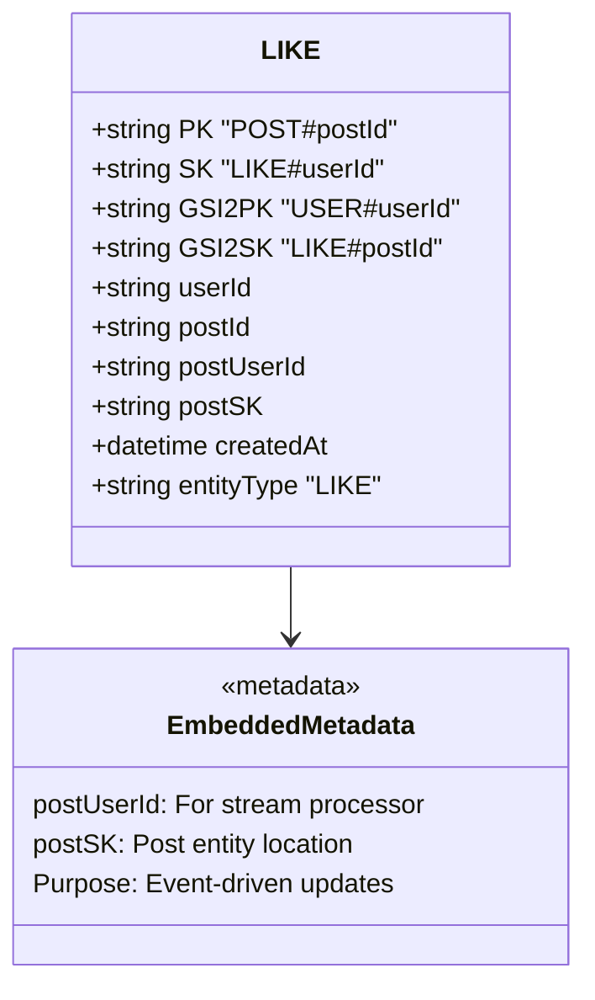
```mermaid
classDiagram
    class LIKE {
        +string PK "POST#postId"
        +string SK "LIKE#userId"
        +string GSI2PK "USER#userId"
        +string GSI2SK "LIKE#postId"

        +string userId
        +string postId
        +string postUserId
        +string postSK
        +datetime createdAt
        +string entityType "LIKE"
    }

    class EmbeddedMetadata {
        <<metadata>>
        postUserId: For stream processor
        postSK: Post entity location
        Purpose: Event-driven updates
    }

    LIKE --> EmbeddedMetadata
```

**Like Flow with Counter Update:**

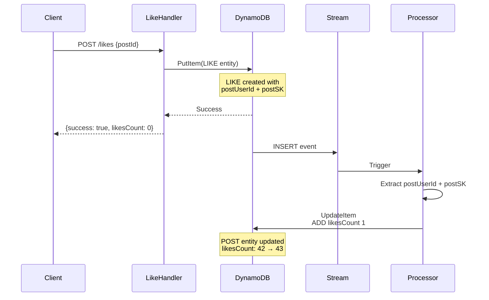
```mermaid
sequenceDiagram
    participant Client
    participant LikeHandler
    participant DynamoDB
    participant Stream
    participant Processor

    Client->>LikeHandler: POST /likes {postId}
    LikeHandler->>DynamoDB: PutItem(LIKE entity)
    Note over DynamoDB: LIKE created with<br/>postUserId + postSK
    DynamoDB-->>LikeHandler: Success
    LikeHandler-->>Client: {success: true, likesCount: 0}

    DynamoDB->>Stream: INSERT event
    Stream->>Processor: Trigger
    Processor->>Processor: Extract postUserId + postSK
    Processor->>DynamoDB: UpdateItem<br/>ADD likesCount 1
    Note over DynamoDB: POST entity updated<br/>likesCount: 42 → 43
```

### COMMENT Entity

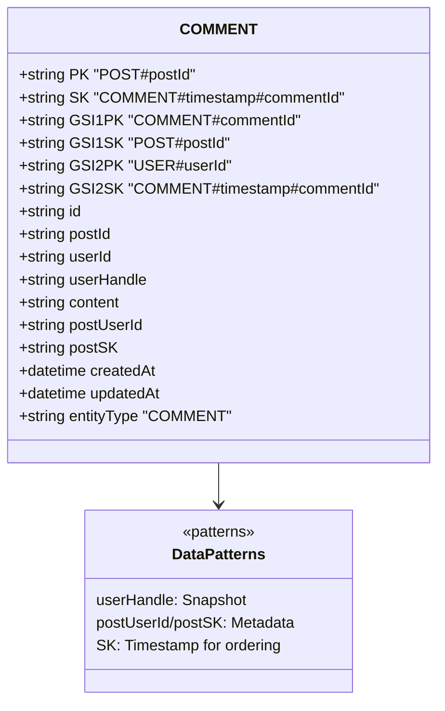
```mermaid
classDiagram
    class COMMENT {
        +string PK "POST#postId"
        +string SK "COMMENT#timestamp#commentId"
        +string GSI1PK "COMMENT#commentId"
        +string GSI1SK "POST#postId"
        +string GSI2PK "USER#userId"
        +string GSI2SK "COMMENT#timestamp#commentId"

        +string id
        +string postId
        +string userId
        +string userHandle
        +string content
        +string postUserId
        +string postSK
        +datetime createdAt
        +datetime updatedAt
        +string entityType "COMMENT"
    }

    class DataPatterns {
        <<patterns>>
        userHandle: Snapshot
        postUserId/postSK: Metadata
        SK: Timestamp for ordering
    }

    COMMENT --> DataPatterns
```

### FOLLOW Entity

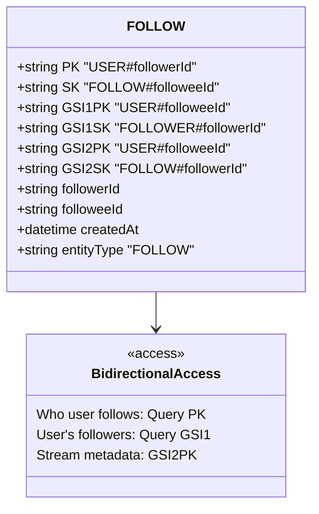
```mermaid
classDiagram
    class FOLLOW {
        +string PK "USER#followerId"
        +string SK "FOLLOW#followeeId"
        +string GSI1PK "USER#followeeId"
        +string GSI1SK "FOLLOWER#followerId"
        +string GSI2PK "USER#followeeId"
        +string GSI2SK "FOLLOW#followerId"

        +string followerId
        +string followeeId
        +datetime createdAt
        +string entityType "FOLLOW"
    }

    class BidirectionalAccess {
        <<access>>
        Who user follows: Query PK
        User's followers: Query GSI1
        Stream metadata: GSI2PK
    }

    FOLLOW --> BidirectionalAccess
```

**Follow Counter Update Flow:**

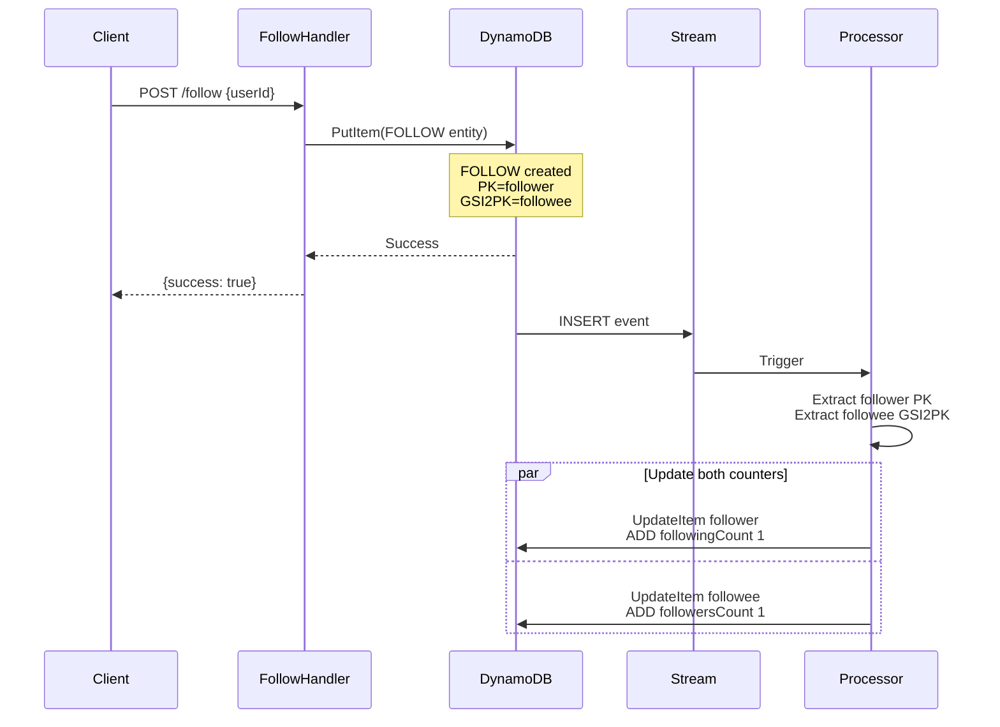
```mermaid
sequenceDiagram
    participant Client
    participant FollowHandler
    participant DynamoDB
    participant Stream
    participant Processor

    Client->>FollowHandler: POST /follow {userId}
    FollowHandler->>DynamoDB: PutItem(FOLLOW entity)
    Note over DynamoDB: FOLLOW created<br/>PK=follower<br/>GSI2PK=followee
    DynamoDB-->>FollowHandler: Success
    FollowHandler-->>Client: {success: true}

    DynamoDB->>Stream: INSERT event
    Stream->>Processor: Trigger
    Processor->>Processor: Extract follower PK<br/>Extract followee GSI2PK

    par Update both counters
        Processor->>DynamoDB: UpdateItem follower<br/>ADD followingCount 1
    and
        Processor->>DynamoDB: UpdateItem followee<br/>ADD followersCount 1
    end
```

---

## Data Duplication Patterns

### Pattern 1: Denormalized Counters

Counters are stored in parent entities and updated asynchronously via DynamoDB Streams.

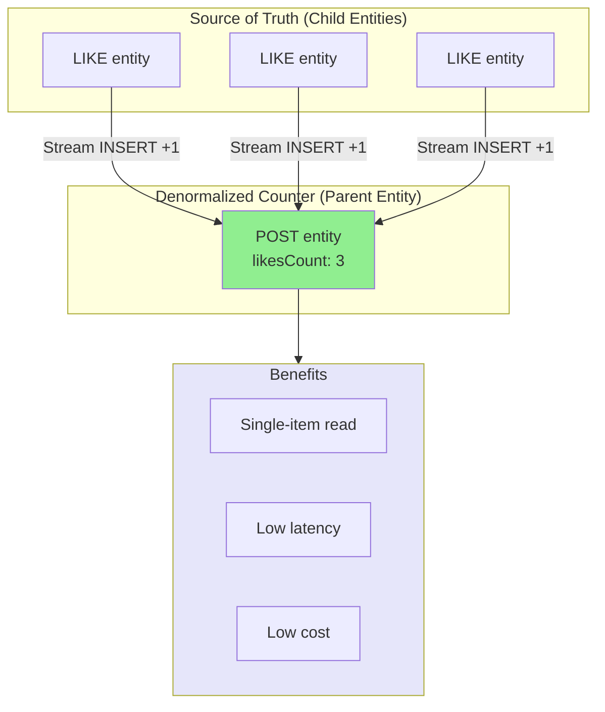
```mermaid
graph TD
    subgraph "Source of Truth (Child Entities)"
        L1[LIKE entity]
        L2[LIKE entity]
        L3[LIKE entity]
    end

    subgraph "Denormalized Counter (Parent Entity)"
        P[POST entity<br/>likesCount: 3]
    end

    L1 -->|Stream INSERT +1| P
    L2 -->|Stream INSERT +1| P
    L3 -->|Stream INSERT +1| P

    subgraph Benefits
        B1[Single-item read]
        B2[Low latency]
        B3[Low cost]
    end

    P --> Benefits

    style P fill:#90EE90
    style Benefits fill:#E6E6FA
```

**Counter Update Flow:**

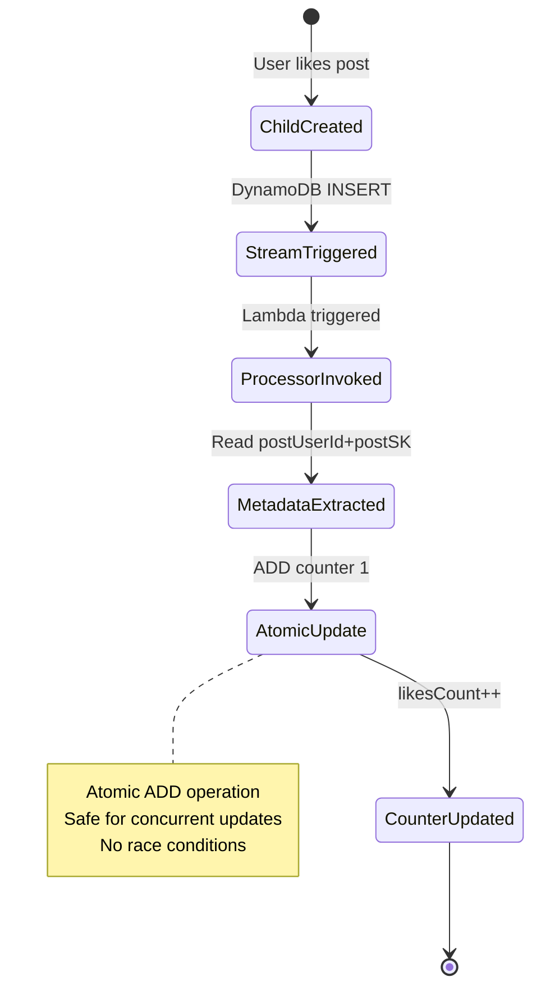
```mermaid
stateDiagram-v2
    [*] --> ChildCreated: User likes post
    ChildCreated --> StreamTriggered: DynamoDB INSERT
    StreamTriggered --> ProcessorInvoked: Lambda triggered
    ProcessorInvoked --> MetadataExtracted: Read postUserId+postSK
    MetadataExtracted --> AtomicUpdate: ADD counter 1
    AtomicUpdate --> CounterUpdated: likesCount++
    CounterUpdated --> [*]

    note right of AtomicUpdate
        Atomic ADD operation
        Safe for concurrent updates
        No race conditions
    end note
```

**Counters in the System:**

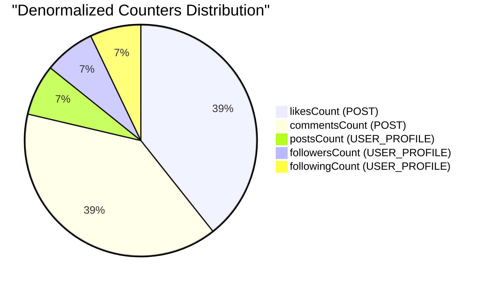
```mermaid
pie title "Denormalized Counters Distribution"
    "likesCount (POST)" : 83
    "commentsCount (POST)" : 83
    "postsCount (USER_PROFILE)" : 15
    "followersCount (USER_PROFILE)" : 15
    "followingCount (USER_PROFILE)" : 15
```

### Pattern 2: Embedded Metadata

Child entities contain parent location information to enable event-driven updates.

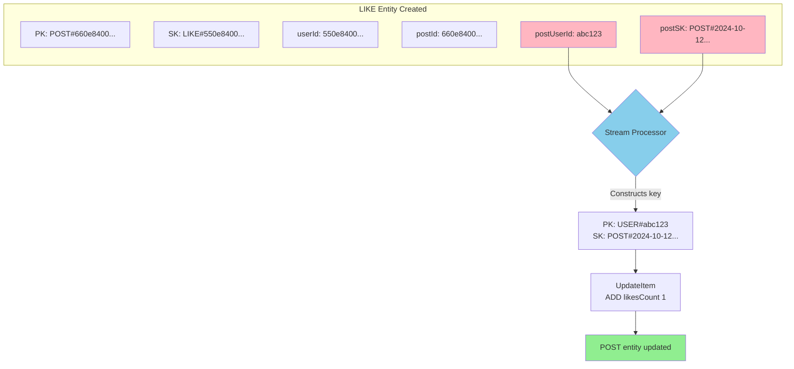
```mermaid
flowchart TB
    subgraph "LIKE Entity Created"
        A[PK: POST#660e8400...]
        B[SK: LIKE#550e8400...]
        C[userId: 550e8400...]
        D[postId: 660e8400...]
        E[postUserId: abc123]
        F[postSK: POST#2024-10-12...]
    end

    E --> G{Stream Processor}
    F --> G

    G -->|Constructs key| H[PK: USER#abc123<br/>SK: POST#2024-10-12...]
    H --> I[UpdateItem<br/>ADD likesCount 1]
    I --> J[POST entity updated]

    style E fill:#FFB6C1
    style F fill:#FFB6C1
    style G fill:#87CEEB
    style J fill:#90EE90
```

**Metadata Size Analysis:**

| Entity Type | Embedded Fields | Size per Entity | Purpose |
|-------------|----------------|-----------------|---------|
| **LIKE** | `postUserId`, `postSK` | 60 bytes | Stream processor needs post location |
| **COMMENT** | `postUserId`, `postSK`, `userHandle` | 80 bytes | Stream processor + display |
| **FOLLOW** | Uses `GSI2PK` | 0 bytes extra | GSI key doubles as metadata |

**Total Overhead:** ~32 KB for 15 users (15.5% of canonical data) - **Acceptable tradeoff**

### Pattern 3: Snapshot Fields

Captures point-in-time values that don't update when source changes.

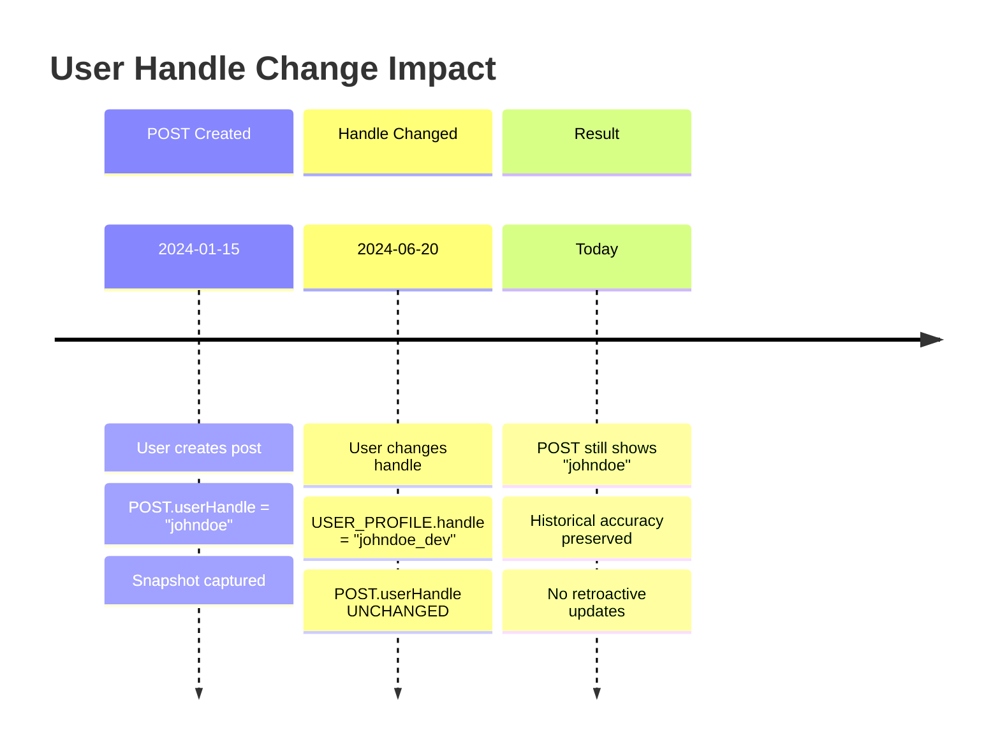
```mermaid
timeline
    title User Handle Change Impact
    section POST Created
        2024-01-15 : User creates post
                   : POST.userHandle = "johndoe"
                   : Snapshot captured
    section Handle Changed
        2024-06-20 : User changes handle
                   : USER_PROFILE.handle = "johndoe_dev"
                   : POST.userHandle UNCHANGED
    section Result
        Today : POST still shows "johndoe"
              : Historical accuracy preserved
              : No retroactive updates
```

**Snapshot vs Live Data:**

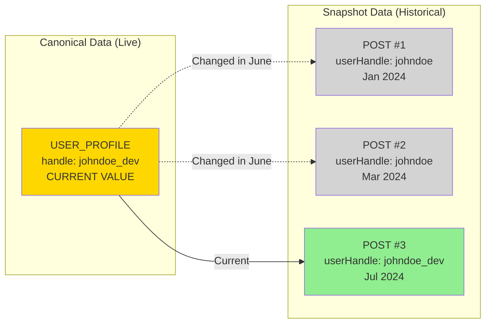
```mermaid
graph LR
    subgraph "Canonical Data (Live)"
        U[USER_PROFILE<br/>handle: johndoe_dev<br/>CURRENT VALUE]
    end

    subgraph "Snapshot Data (Historical)"
        P1[POST #1<br/>userHandle: johndoe<br/>Jan 2024]
        P2[POST #2<br/>userHandle: johndoe<br/>Mar 2024]
        P3[POST #3<br/>userHandle: johndoe_dev<br/>Jul 2024]
    end

    U -.->|Changed in June| P1
    U -.->|Changed in June| P2
    U -->|Current| P3

    style U fill:#FFD700
    style P1 fill:#D3D3D3
    style P2 fill:#D3D3D3
    style P3 fill:#90EE90
```

**Snapshot Fields in System:**

| Entity | Snapshot Field | Source | Update Strategy |
|--------|---------------|--------|-----------------|
| POST | `userHandle` | USER_PROFILE.handle | ❌ Never updates |
| COMMENT | `userHandle` | USER_PROFILE.handle | ❌ Never updates |

**Rationale:**
- ✅ **Historical accuracy**: Shows "who was this user when they posted"
- ✅ **Query efficiency**: No JOIN needed to display posts
- ✅ **Data integrity**: Comments don't break if user changes handle
- ⚠️ **Acceptable staleness**: Handles rarely change

---

## Stream Processing and Synchronization

### Stream Architecture Overview

```mermaid
flowchart TB
    subgraph "DynamoDB Table"
        T[(tamafriends-local)]
        S[DynamoDB Stream<br/>24-hour retention]
    end

    T -->|Change events| S

    subgraph "Stream Processors (Lambda)"
        P1[like-counter.ts]
        P2[comment-counter.ts]
        P3[follow-counter.ts]
    end

    S -->|LIKE INSERT/REMOVE| P1
    S -->|COMMENT INSERT/REMOVE| P2
    S -->|FOLLOW INSERT/REMOVE| P3

    P1 -->|UpdateItem<br/>ADD likesCount| T
    P2 -->|UpdateItem<br/>ADD commentsCount| T
    P3 -->|UpdateItem<br/>ADD follower/followingCount| T

    style S fill:#FFD700
    style P1 fill:#87CEEB
    style P2 fill:#87CEEB
    style P3 fill:#87CEEB
```

### Like Counter Stream Processor

```mermaid
sequenceDiagram
    autonumber
    participant User
    participant API
    participant DynamoDB as DynamoDB Table
    participant Stream as DynamoDB Stream
    participant Processor as like-counter Lambda

    User->>API: POST /likes/post123
    API->>DynamoDB: PutItem(LIKE entity)
    Note over DynamoDB: PK: POST#post123<br/>SK: LIKE#user456<br/>postUserId: user789<br/>postSK: POST#2024...

    DynamoDB->>Stream: INSERT event
    Note over Stream: NewImage contains<br/>full LIKE entity

    Stream->>Processor: Trigger Lambda

    Processor->>Processor: Extract metadata<br/>postUserId: user789<br/>postSK: POST#2024...

    Processor->>Processor: Build update key<br/>PK: USER#user789<br/>SK: POST#2024...

    Processor->>DynamoDB: UpdateItem<br/>ADD likesCount 1

    Note over DynamoDB: POST entity<br/>likesCount: 42 → 43

    DynamoDB-->>Processor: Success

    Note over User: Next read shows<br/>updated count
```

### Comment Counter Stream Processor

```mermaid
sequenceDiagram
    participant Client
    participant DynamoDB
    participant Stream
    participant Processor

    Client->>DynamoDB: PutItem(COMMENT entity)
    Note over DynamoDB: Contains postUserId + postSK

    DynamoDB->>Stream: INSERT event
    Stream->>Processor: Trigger

    alt Successful Processing
        Processor->>Processor: Extract metadata
        Processor->>DynamoDB: UpdateItem ADD commentsCount 1
        DynamoDB-->>Processor: Success
        Note over Processor: Log success
    else Error Handling
        Processor->>Processor: Missing metadata
        Note over Processor: Log error, skip
        Note over Processor: Continue other records
    end
```

### Follow Counter Stream Processor

```mermaid
sequenceDiagram
    participant Client
    participant DynamoDB
    participant Stream
    participant Processor

    Client->>DynamoDB: PutItem(FOLLOW entity)
    Note over DynamoDB: PK: USER#follower<br/>GSI2PK: USER#followee

    DynamoDB->>Stream: INSERT event
    Stream->>Processor: Trigger

    Processor->>Processor: Extract PK (follower)
    Processor->>Processor: Extract GSI2PK (followee)

    par Update Both Counters
        Processor->>DynamoDB: Update follower<br/>ADD followingCount 1
    and
        Processor->>DynamoDB: Update followee<br/>ADD followersCount 1
    end

    Note over DynamoDB: Both profiles updated atomically
```

### Stream Processing Guarantees

```mermaid
mindmap
  root((DynamoDB Streams))
    Delivery
      At-Least-Once
      May retry on failure
      Idempotency needed
    Ordering
      Per partition key
      Across partitions may vary
      Sequential processing
    Retention
      24 hours
      Replay possible
      Failure recovery
    Operations
      Atomic ADD
      No race conditions
      Concurrent-safe
    Consistency
      Eventual ~1 second
      Acceptable for UX
      Stream lag minimal
```

### Error Handling Flow

```mermaid
stateDiagram-v2
    [*] --> RecordReceived: Stream event
    RecordReceived --> ValidateRecord: Check entity type

    ValidateRecord --> ExtractMetadata: Valid LIKE/COMMENT
    ValidateRecord --> LogAndSkip: Wrong entity type

    ExtractMetadata --> CheckMetadata: Has postUserId+postSK?

    CheckMetadata --> AtomicUpdate: Metadata present
    CheckMetadata --> LogError: Missing metadata

    AtomicUpdate --> UpdateSuccess: DynamoDB accepts
    AtomicUpdate --> RetryLogic: DynamoDB error

    RetryLogic --> AtomicUpdate: Retry attempt
    RetryLogic --> DLQ: Max retries exceeded

    UpdateSuccess --> [*]
    LogAndSkip --> [*]
    LogError --> [*]: Continue other records
    DLQ --> [*]: Manual investigation
```

---

## Feed Architecture

### Phase 1: Query-Time (Current Implementation)

```mermaid
flowchart TD
    A[User Request: GET /feed/following] --> B[Get Following List]
    B --> C{Has following?}

    C -->|No| D[Return empty feed]
    C -->|Yes| E[For each followed user...]

    E --> F1[Query USER#user1 posts]
    E --> F2[Query USER#user2 posts]
    E --> F3[Query USER#user3 posts]
    E --> F4[Query USER#user4 posts]

    F1 --> G[Collect all posts]
    F2 --> G
    F3 --> G
    F4 --> G

    G --> H[Sort by createdAt DESC]
    H --> I[Take top 24]
    I --> J[Return to client]

    style E fill:#FFB6C1
    style G fill:#FFD700
    style I fill:#90EE90
```

**N+1 Query Pattern (Current):**

```mermaid
sequenceDiagram
    participant Client
    participant PostService
    participant FollowService
    participant DynamoDB

    Client->>PostService: getFollowingFeedPosts(userId)
    PostService->>FollowService: getFollowingList(userId)
    FollowService->>DynamoDB: Query followers
    DynamoDB-->>FollowService: [user1, user2, user3, user4, user5]
    FollowService-->>PostService: followingIds[]

    loop For each followed user
        PostService->>DynamoDB: Query USER#userId posts
        DynamoDB-->>PostService: user's posts
    end

    Note over PostService: Merge & sort in-memory

    PostService-->>Client: Sorted feed (24 posts)

    rect rgb(255, 182, 193)
        Note right of PostService: N+1 Pattern:<br/>1 query for following<br/>N queries for posts<br/>(5 queries total here)
    end
```

**Performance Characteristics:**

| Following Count | Queries | Latency (P95) | Cost (RCU) |
|-----------------|---------|---------------|------------|
| 10 users | 11 | ~150ms | ~12 RCU |
| 50 users | 51 | ~400ms | ~60 RCU |
| 100 users | 101 | ~800ms | ~120 RCU |
| 500 users | 501 | >2000ms | ~600 RCU |

**Status:** ✅ **Acceptable for Phase 1** (<50 following typical)

### Phase 2: Hybrid Approach (Future)

```mermaid
flowchart TD
    A[User Request: GET /feed/following] --> B{Check Materialized Cache}

    B -->|Cache Hit: 25+ items| C[Return from cache]
    B -->|Cache Miss| D[Fallback to Query-Time]
    B -->|Partial: <25 items| E[Hybrid: Cache + Query-Time]

    subgraph "Materialized Feed (Top 25)"
        F1[FEED#user123 ITEM#001]
        F2[FEED#user123 ITEM#002]
        F3[FEED#user123 ITEM#025]
    end

    C --> F1
    D --> G[Query-Time Logic]
    E --> F1
    E --> G

    G --> H[Return merged results]
    F1 --> H

    style B fill:#FFD700
    style F1 fill:#90EE90
    style G fill:#87CEEB
```

**Feed Materialization Strategy:**

```mermaid
flowchart LR
    subgraph "When User Creates Post"
        P1[POST created]
        P1 --> S[DynamoDB Stream]
    end

    S --> D{Check Followers}

    D -->|<1000 followers| F[Fan-Out on Write]
    D -->|>1000 followers| Q[Query-Time Only]

    F --> W1[Write to follower1's feed cache]
    F --> W2[Write to follower2's feed cache]
    F --> W3[Write to follower3's feed cache]

    W1 --> L[Limit: Top 25 per user]
    W2 --> L
    W3 --> L

    L --> T[TTL: 7 days]

    style D fill:#FFD700
    style F fill:#87CEEB
    style Q fill:#FFB6C1
```

**Comparison: Phase 1 vs Phase 2:**

```mermaid
graph TB
    subgraph "Phase 1: Query-Time Only"
        P1A[All posts queried at read time]
        P1B[N queries per feed request]
        P1C[Always fresh data]
        P1D[Simple to maintain]
    end

    subgraph "Phase 2: Hybrid"
        P2A[Top 25 posts materialized]
        P2B[1-2 queries per feed request]
        P2C[Eventual consistency]
        P2D[Stream processor complexity]
    end

    subgraph "Phase 3: Full Materialization (Not Planned)"
        P3A[All feed items pre-computed]
        P3B[Instant reads]
        P3C[High write amplification]
        P3D[Celebrity problem]
    end

    P1A -.Evolve.-> P2A
    P2A -.Future?..-> P3A
```

### Feed Query Patterns

```mermaid
graph LR
    subgraph "Access Patterns"
        A1[Home Feed: Following posts]
        A2[Explore Feed: All public posts]
        A3[Profile Feed: User's posts]
    end

    A1 --> B1[Query-Time<br/>N queries]
    A2 --> B2[Scan<br/>FilterExpression]
    A3 --> B3[Single Query<br/>PK=USER#userId]

    B1 --> C1[Performance: Variable]
    B2 --> C2[Performance: Slow]
    B3 --> C3[Performance: Fast]

    style A1 fill:#FFB6C1
    style A2 fill:#FFD700
    style A3 fill:#90EE90
```

---

## Storage Analysis and Cost Implications

### Storage Breakdown

```mermaid
pie title "Storage Distribution (Current: 556 KB total)"
    "Canonical Data" : 206
    "GSI Keys" : 314
    "Embedded Metadata" : 32
    "Snapshot Fields" : 3.7
    "Counters" : 0.844
```

**Canonical Data Components:**

```mermaid
pie title "Canonical Data Breakdown (206 KB)"
    "POST entities (83)" : 66
    "LIKE entities (400)" : 80
    "COMMENT entities (100)" : 30
    "USER_PROFILE (15)" : 15
    "FOLLOW entities (100)" : 15
```

### Duplication Analysis

| Data Type | Purpose | Size | % of Canonical | Justified? |
|-----------|---------|------|----------------|------------|
| **Canonical Data** | Core entities | 206 KB | 100% (baseline) | ✅ Required |
| **GSI Keys** | Access patterns | 314 KB | 152% | ✅ Required for DynamoDB |
| **Embedded Metadata** | Stream processing | 32 KB | 15.5% | ✅ Event-driven architecture |
| **Snapshot Fields** | Historical accuracy | 3.7 KB | 1.8% | ✅ Query efficiency |
| **Denormalized Counters** | Performance | 844 bytes | 0.4% | ✅ Avoids scans |
| **Total Storage** | All data | 556 KB | 270% | ✅ **Excellent tradeoff** |

### Cost Analysis (Current Scale)

**Current: 15 users, ~1,571 items, 556 KB**

```mermaid
graph TD
    A[DynamoDB On-Demand Pricing]
    A --> B[Storage: $0.25/GB-month]
    A --> C[Writes: $1.25/million WRU]
    A --> D[Reads: $0.25/million RRU]

    B --> E[556 KB = 0.00054 GB<br/>Cost: $0.000135/month<br/>~$0.00]

    C --> F[Typical usage:<br/>100 writes/day<br/>Cost: $0.0038/month]

    D --> G[Typical usage:<br/>1000 reads/day<br/>Cost: $0.0075/month]

    E --> H[Total Monthly: $0.01]
    F --> H
    G --> H

    style H fill:#90EE90
```

### Growth Projections

```mermaid
graph LR
    subgraph "10K Users"
        A1[Canonical: 1.7 GB]
        A2[With Duplication: 2.9 GB]
        A3[Monthly Cost: $0.73]
    end

    subgraph "100K Users"
        B1[Canonical: 17 GB]
        B2[With Duplication: 29 GB]
        B3[Monthly Cost: $7.25]
    end

    subgraph "1M Users"
        C1[Canonical: 170 GB]
        C2[With Duplication: 290 GB]
        C3[Monthly Cost: $72.50]
    end

    A1 --> A2 --> A3
    B1 --> B2 --> B3
    C1 --> C2 --> C3

    A3 -.Scale.-> B3
    B3 -.Scale.-> C3

    style A3 fill:#90EE90
    style B3 fill:#FFD700
    style C3 fill:#FFB6C1
```

**Key Insight:** Storage duplication overhead (1.7×) is **negligible** even at 1M users ($72.50/month). Query performance benefits far outweigh storage costs.

### Cost Comparison: Normalized vs Denormalized

```mermaid
flowchart TB
    subgraph "Normalized (No Counters)"
        N1[Read post]
        N2[Scan all LIKE entities]
        N3[Count in application]
        N4[Return post + count]

        N1 --> N2
        N2 --> N3
        N3 --> N4

        N5[Cost: 1 RCU + N RCU<br/>where N = like count]
    end

    subgraph "Denormalized (Current)"
        D1[Read post with likesCount]
        D2[Return immediately]

        D1 --> D2

        D3[Cost: 1 RCU flat]
    end

    N4 --> C{Compare}
    D2 --> C

    C --> R[Denormalized saves:<br/>99% of reads<br/>for popular posts]

    style D3 fill:#90EE90
    style N5 fill:#FFB6C1
    style R fill:#FFD700
```

---

## Best Practices and Recommendations

### What's Working Well ✅

```mermaid
mindmap
  root((Current Design))
    Pagination
      Opaque cursors
      DynamoDB native
      O1 performance
    GSI Strategy
      Well-documented
      Clear patterns
      Sparse indexes
    Counters
      Event-driven
      Atomic updates
      Low overhead
    No Feed Cache
      Simple Phase 1
      Fresh data
      Easy to debug
```

### Design Patterns Applied

| Pattern | Implementation | Benefit |
|---------|---------------|---------|
| **Single Table Design** | All entities in one table | Cost efficiency, consistent queries |
| **Composite Keys** | `POST#timestamp#uuid` | Natural sorting, uniqueness |
| **Sparse GSIs** | Only set when needed | Minimize index cost |
| **Stream Processing** | Async counter updates | Event-driven, decoupled |
| **Embedded Metadata** | `postUserId` + `postSK` in LIKE | No additional queries |
| **Snapshot Fields** | `userHandle` in POST | Historical accuracy |
| **Opaque Cursors** | Base64-encoded keys | Implementation flexibility |

### Areas for Future Optimization

```mermaid
flowchart TB
    A[Current State] --> B{Scale to 10K+ users?}

    B -->|Yes| C[Implement Phase 2 Hybrid Feed]
    B -->|No| D[Keep current design]

    C --> E[Materialize top 25 posts]
    C --> F[Add celebrity threshold]
    C --> G[Implement TTL on feed items]

    E --> H[Reduce feed query latency<br/>from 400ms to <100ms]

    style A fill:#90EE90
    style C fill:#FFD700
    style H fill:#87CEEB
```

**Optimization Priority:**

1. **High Priority (when following >100 users becomes common):**
   - Implement hybrid feed (Phase 2)
   - Add materialized cache for top 25 posts
   - Celebrity threshold (>1000 followers = no fan-out)

2. **Medium Priority (when users >10K):**
   - Add caching layer (Redis/DAX) for hot profiles
   - Implement batch operations for feed queries
   - Add read replicas for high-traffic endpoints

3. **Low Priority (nice-to-have):**
   - Cursor expiration/versioning
   - Cursor compression (if >300 bytes common)
   - Stream processor monitoring dashboard

### Anti-Patterns to Avoid ❌

```mermaid
flowchart LR
    A[Temptations] --> B{What NOT to do}

    B --> C[❌ Offset-based pagination]
    B --> D[❌ Full feed materialization<br/>without thresholds]
    B --> E[❌ Synchronous counter updates]
    B --> F[❌ Multiple table design]
    B --> G[❌ Real-time snapshot updates]

    C --> C1[Causes: O(n) performance]
    D --> D1[Causes: Write amplification]
    E --> E1[Causes: High latency]
    F --> F1[Causes: Cost explosion]
    G --> G1[Causes: Unnecessary complexity]

    style C fill:#FF6B6B
    style D fill:#FF6B6B
    style E fill:#FF6B6B
    style F fill:#FF6B6B
    style G fill:#FF6B6B
```

### When to Revisit Design Decisions

```mermaid
flowchart TD
    A[Monitor Metrics] --> B{Trigger Condition?}

    B -->|Feed latency >500ms| C[Implement Phase 2 Hybrid]
    B -->|Cursor size >500 bytes| D[Add cursor compression]
    B -->|Stream lag >5 seconds| E[Optimize stream processors]
    B -->|Storage cost >$100/month| F[Audit GSI necessity]
    B -->|Following >100 avg| G[Implement feed cache]

    C --> H[Action Required]
    D --> H
    E --> H
    F --> H
    G --> H

    B -->|All metrics healthy| I[Keep current design]

    style B fill:#FFD700
    style I fill:#90EE90
    style H fill:#FFB6C1
```

### Summary: Design Quality Assessment

| Aspect | Grade | Notes |
|--------|-------|-------|
| **Cursor Pagination** | A+ | Optimal for DynamoDB, stateless, scalable |
| **GSI Strategy** | A | Well-documented, efficient access patterns |
| **Counter Denormalization** | A+ | Excellent tradeoff, event-driven, atomic |
| **Embedded Metadata** | A | Enables stream processing, minimal overhead |
| **Feed Architecture** | B+ | Good for Phase 1, needs hybrid for scale |
| **Storage Efficiency** | A | 1.7× duplication is excellent for NoSQL |
| **Cost Optimization** | A+ | Negligible costs at current scale |
| **Maintainability** | A | Clean separation, well-tested, documented |

**Overall Grade: A** - Excellent DynamoDB single-table design with smart tradeoffs.

---

## Conclusion

The TamaFriends DynamoDB single-table design demonstrates **best practices** for NoSQL data modeling:

### Key Strengths

1. **Opaque Cursor Pagination**: Native DynamoDB support with O(1) performance
2. **Strategic Denormalization**: 1.7× storage overhead for massive query performance gains
3. **Event-Driven Architecture**: DynamoDB Streams for async counter synchronization
4. **Cost-Effective**: $0.01/month at current scale, $72/month at 1M users
5. **Well-Documented**: Clear GSI strategy and access patterns

### Recommended Path Forward

**Today:** Keep current design - it's excellent for Phase 1

**At 10K users:** Implement Phase 2 hybrid feed with materialized cache

**At 100K users:** Add caching layer (Redis/DAX) for hot data

**At 1M users:** Consider read replicas and advanced optimization

### Final Verdict

✅ **No changes needed** - this is a well-architected DynamoDB application that correctly prioritizes query performance over storage cost. The design scales efficiently and follows single-table best practices.

---

**Document Version:** 1.0
**Last Updated:** October 2025
**Maintainer:** Development Team
**Related Docs:**
- [ARCHITECTURE.md](./ARCHITECTURE.md)
- [FEED_ARCHITECTURE_ANALYSIS.md](./FEED_ARCHITECTURE_ANALYSIS.md)
- [packages/dal/docs/GSI_STRATEGY.md](./packages/dal/docs/GSI_STRATEGY.md)
