# DynamoDB: Entities vs Physical Partitions

**Understanding the Mental Model vs Physical Reality**

---

## Table of Contents

1. [The Key Insight](#the-key-insight)
2. [Entities: Your Logical Organization](#entities-your-logical-organization)
3. [Physical Reality: One Flat Table](#physical-reality-one-flat-table)
4. [AWS Auto-Sharding Explained](#aws-auto-sharding-explained)
5. [What You Control vs What AWS Controls](#what-you-control-vs-what-aws-controls)
6. [How Queries Work](#how-queries-work)
7. [Design Patterns](#design-patterns)
8. [Summary](#summary)

---

## The Key Insight

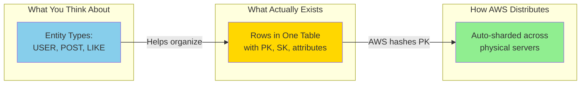

**Core Truth:**
- **Entities** = Logical concept to help YOU organize (not a database feature)
- **Rows** = Physical reality (one big table of items)
- **Partitions** = AWS-managed servers (you never touch these)

---

## Entities: Your Logical Organization

### The Mental Model (How We Think)

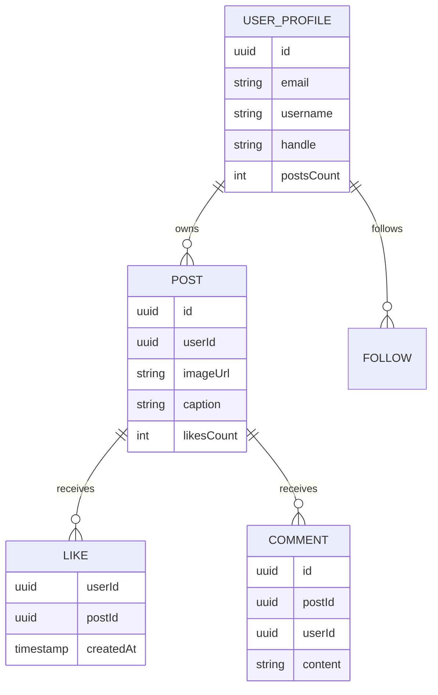

**This diagram is conceptual!** It helps us design and think, but DynamoDB doesn't have these "tables."

### Entities as Naming Conventions

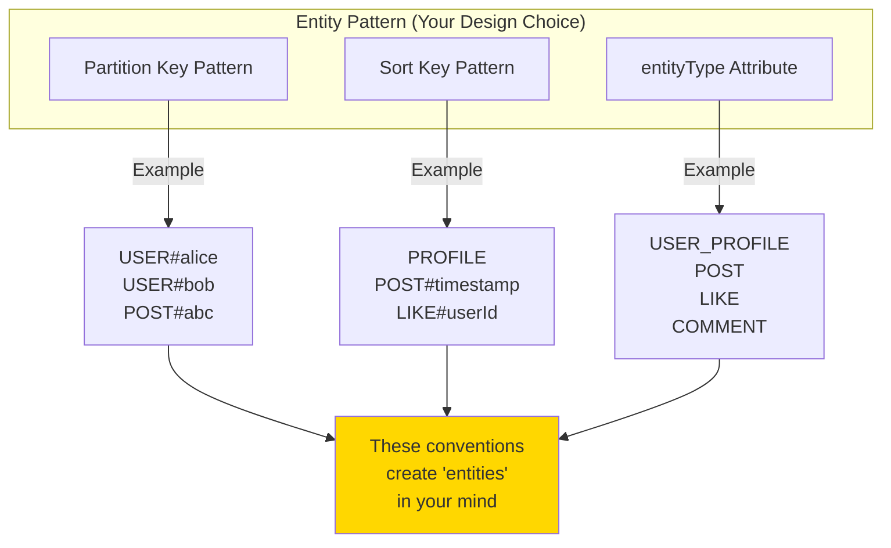

**Key Point:** `entityType: "POST"` is just a string attribute you add. DynamoDB doesn't care about it - it's for YOUR code to understand what type of data it is.

---

## Physical Reality: One Flat Table

### What DynamoDB Actually Stores

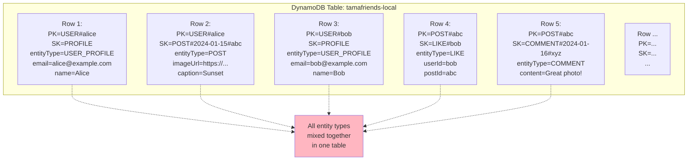

### Table Structure: The Reality

**Conceptual view of actual storage:**

| PK | SK | entityType | email | name | imageUrl | caption | userId | postId | content | ... |
|----|-------|------------|-------|------|----------|---------|--------|--------|---------|-----|
| USER#alice | PROFILE | USER_PROFILE | alice@... | Alice | - | - | - | - | - | ... |
| USER#alice | POST#2024-01-15#abc | POST | - | - | https://... | Sunset | - | - | - | ... |
| USER#bob | PROFILE | USER_PROFILE | bob@... | Bob | - | - | - | - | - | ... |
| POST#abc | LIKE#bob | LIKE | - | - | - | - | bob | abc | - | ... |
| POST#abc | COMMENT#2024-01-16#xyz | COMMENT | - | - | - | - | - | abc | Great! | ... |

**Notice:**
- One flat table with all entity types
- Different rows have different attributes (sparse)
- `entityType` is just another attribute (not special to DynamoDB)

### Visualization: Flat Storage

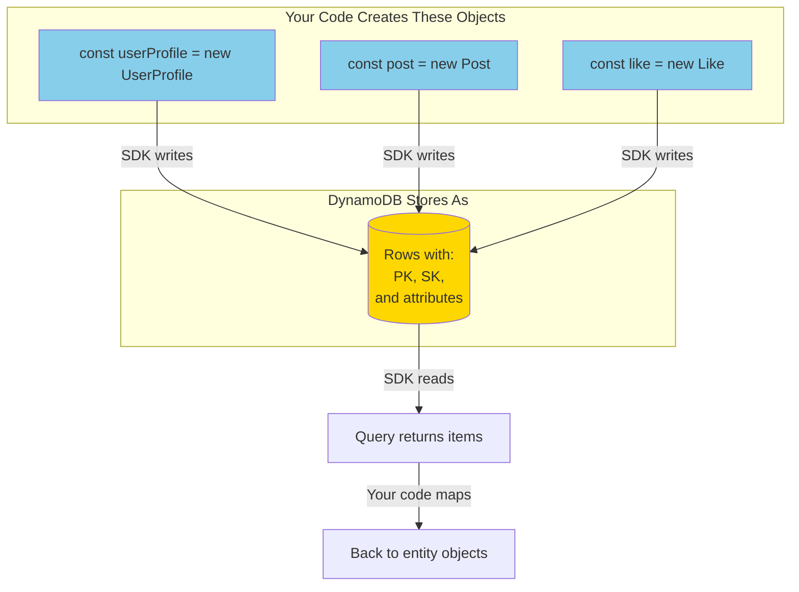

---

## AWS Auto-Sharding Explained

### The Hash Function (Black Box)

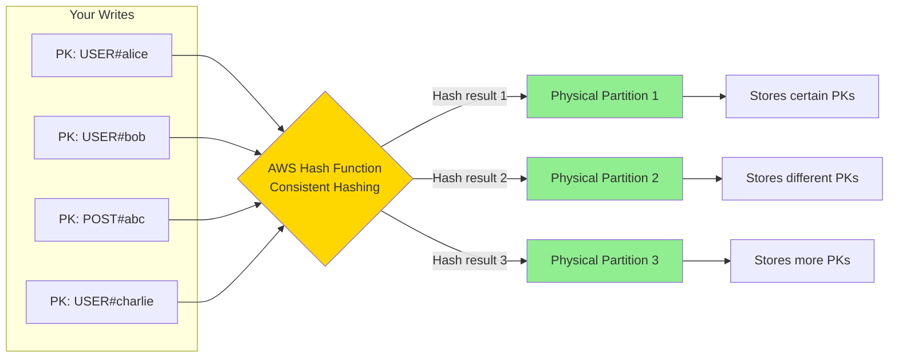

**You NEVER know or control which partition!** AWS handles this automatically.

### How Items Get Distributed

```mermaid
graph TB
    subgraph "Your Data (Logical View)"
        direction TB
        A1[Alice's Profile]
        A2[Alice's Post 1]
        A3[Alice's Post 2]
        B1[Bob's Profile]
        B2[Bob's Post 1]
        L1[Like on Alice's post]
    end

    subgraph "Physical Distribution (AWS Managed)"
        direction LR

        subgraph "Server in Virginia"
            V1[USER#alice → PROFILE]
            V2[USER#alice → POST#...]
            V3[USER#alice → POST#...]
        end

        subgraph "Server in Ohio"
            O1[USER#bob → PROFILE]
            O2[USER#bob → POST#...]
        end

        subgraph "Server in Oregon"
            OR1[POST#abc → LIKE#bob]
        end
    end

    A1 -.AWS decides.-> V1
    A2 -.AWS decides.-> V2
    A3 -.AWS decides.-> V3
    B1 -.AWS decides.-> O1
    B2 -.AWS decides.-> O2
    L1 -.AWS decides.-> OR1

    style V1 fill:#90EE90
    style O1 fill:#FFD700
    style OR1 fill:#FFB6C1
```

### Same PK = Same Physical Partition

```mermaid
flowchart TB
    subgraph "Items with PK=USER#alice"
        I1[SK: PROFILE]
        I2[SK: POST#2024-01-10#xyz]
        I3[SK: POST#2024-01-15#abc]
        I4[SK: POST#2024-01-20#def]
    end

    I1 --> Group[All stored together<br/>on same physical server]
    I2 --> Group
    I3 --> Group
    I4 --> Group

    Group --> Benefit1[✅ Fast queries]
    Group --> Benefit2[✅ One network hop]
    Group --> Benefit3[✅ Pre-sorted by SK]

    style Group fill:#90EE90
    style Benefit1 fill:#87CEEB
    style Benefit2 fill:#87CEEB
    style Benefit3 fill:#87CEEB
```

**This is why you design PK carefully!** Related data should share the same PK.

### Distribution Strategy

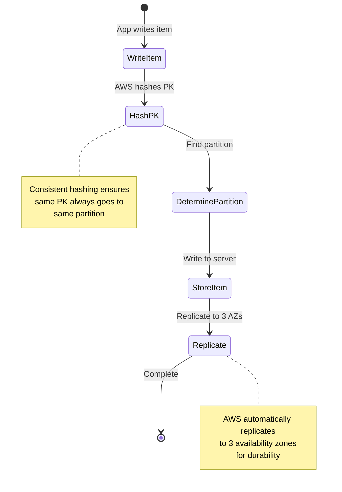

---

## What You Control vs What AWS Controls

### Responsibility Matrix

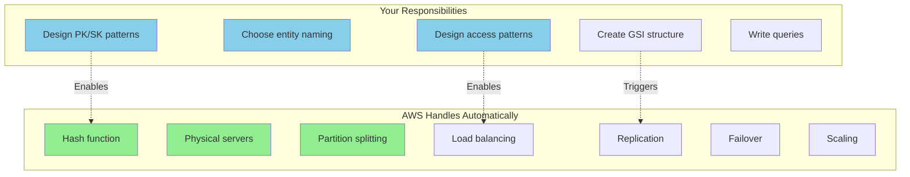

### The Division of Labor

| Aspect | You Decide | AWS Manages |
|--------|-----------|-------------|
| **Partition Key** | ✅ Choose pattern (USER#..., POST#...) | ✅ Hash to determine server |
| **Sort Key** | ✅ Choose pattern (PROFILE, POST#...) | ✅ Sort order on disk |
| **Entity Types** | ✅ Define conventions | ❌ (AWS doesn't know about this) |
| **Physical Servers** | ❌ Never touch | ✅ Provision and manage |
| **Data Distribution** | ❌ Can't control | ✅ Automatic sharding |
| **Scaling** | ❌ Not needed | ✅ Auto-scales partitions |
| **Replication** | ❌ Not your concern | ✅ 3-way replication |
| **Backups** | ✅ Enable/schedule | ✅ Handles mechanics |

### What Happens Behind the Scenes

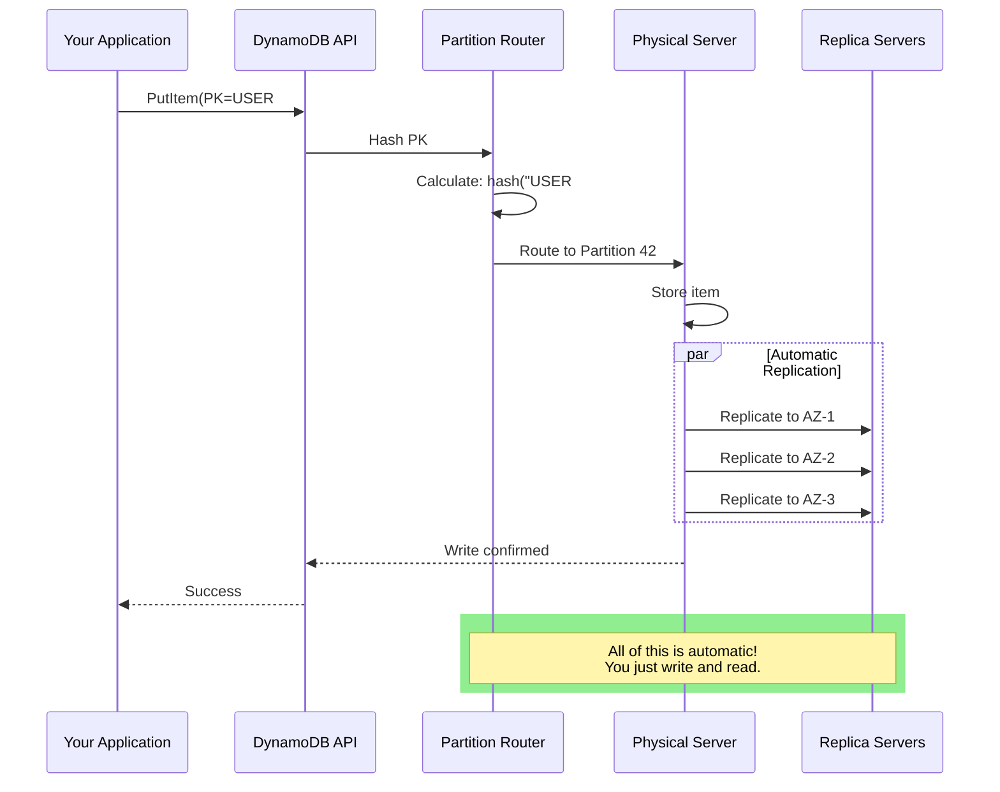

---

## How Queries Work

### Query: Get User's Posts

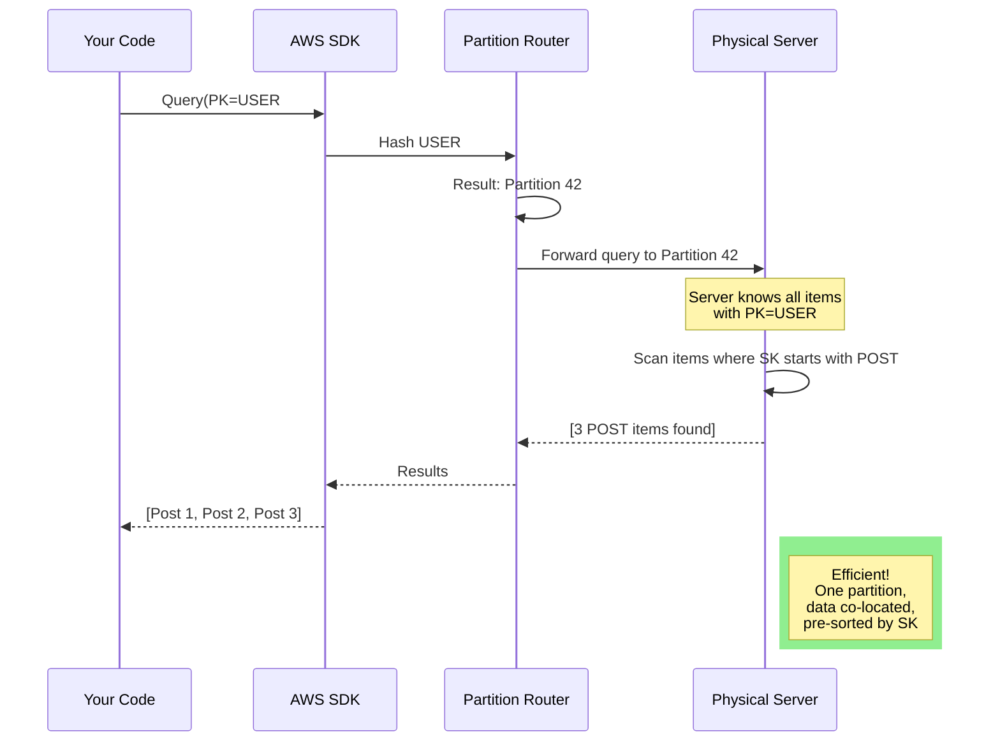

### Query Performance Benefits

```mermaid
flowchart TB
    Q[Query: PK=USER#alice]

    Q --> H[AWS hashes PK]
    H --> P[Determines: Partition 42]
    P --> S[Server reads local data]

    S --> B1[✅ Single server<br/>One network hop]
    S --> B2[✅ Data co-located<br/>No scatter-gather]
    S --> B3[✅ Pre-sorted by SK<br/>No sorting needed]

    B1 --> R[Fast response: ~5-10ms]
    B2 --> R
    B3 --> R

    style H fill:#FFD700
    style P fill:#FFD700
    style R fill:#90EE90
```

### Query vs Scan

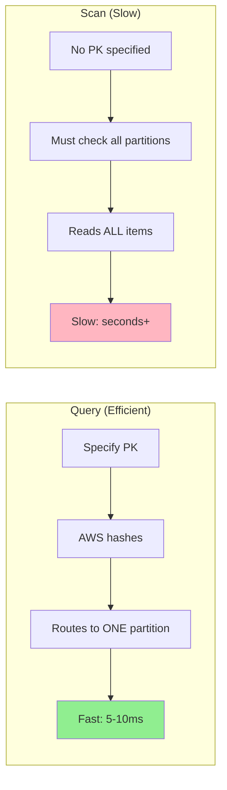

**Always query by PK when possible!**

---

## Design Patterns

### Pattern 1: Group Related Data by PK

```mermaid
flowchart TB
    subgraph "Good Design: Same PK"
        G1[PK: USER#alice]
        G2[SK: PROFILE]
        G3[SK: POST#2024-01-15#abc]
        G4[SK: POST#2024-01-20#def]
    end

    G1 --> G2
    G1 --> G3
    G1 --> G4

    G2 --> R1[One query gets user<br/>+ all their posts]
    G3 --> R1
    G4 --> R1

    R1 --> B1[✅ Efficient<br/>✅ Co-located<br/>✅ Fast]

    style R1 fill:#90EE90
    style B1 fill:#87CEEB
```

### Pattern 2: Multiple Access Patterns with GSIs

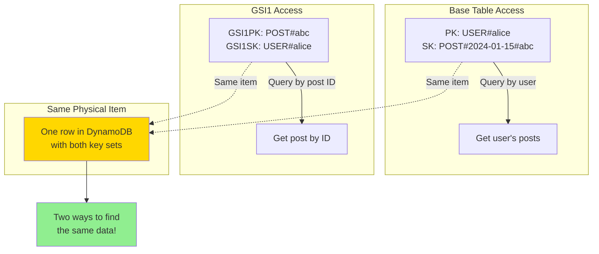

### Pattern 3: Entity Type Filtering

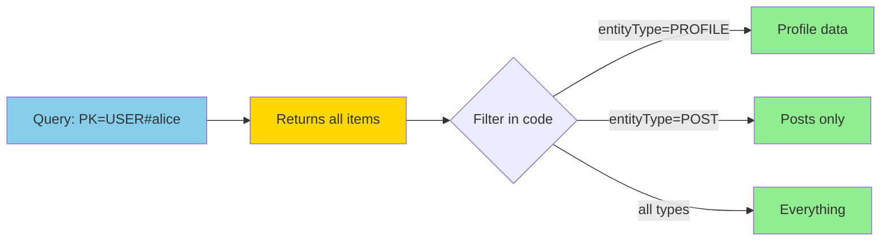

### Pattern 4: Hierarchical SK for Sorting

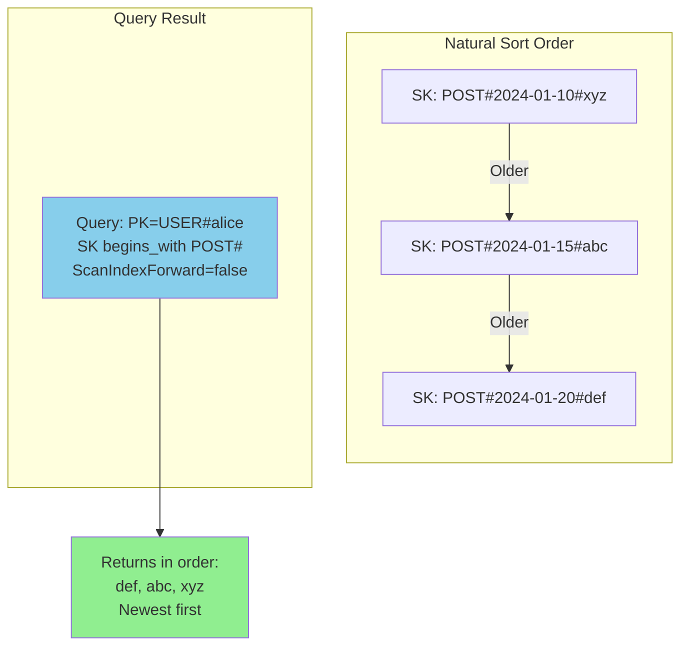

---

## Summary

### Mental Model vs Reality

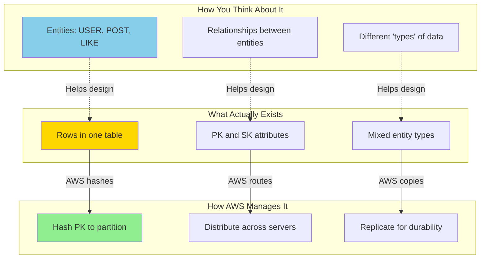

### Key Takeaways

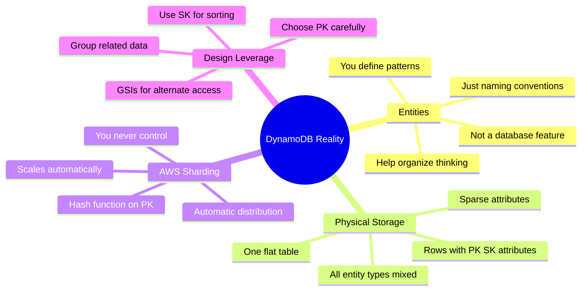

### The Beautiful Abstraction

| Layer | What It Is | Who Controls |
|-------|-----------|--------------|
| **Application Layer** | Entity objects (User, Post, Like) | ✅ You |
| **Data Model Layer** | PK/SK patterns, entity conventions | ✅ You |
| **DynamoDB Layer** | Rows with attributes | 🤝 Shared interface |
| **Physical Layer** | Servers, partitions, replication | ✅ AWS |

**The magic:** You design the logical structure (entities, keys), AWS handles the physical complexity (sharding, scaling, servers). You get distributed database performance without the operational burden!

### Core Principles

1. **Entities are conceptual** - They help YOU organize, not DynamoDB
2. **One table, all entity types** - Mixed together in flat storage
3. **AWS auto-shards by PK** - You never think about physical partitions
4. **Same PK = co-located** - Your design lever for performance
5. **GSIs = alternate views** - Different keys for different access patterns

---

## Related Documentation

- [DYNAMODB_DESIGN_DEEP_DIVE.md](./DYNAMODB_DESIGN_DEEP_DIVE.md) - Complete design analysis with all patterns
- [packages/dal/docs/GSI_STRATEGY.md](./packages/dal/docs/GSI_STRATEGY.md) - GSI allocation rules
- [FEED_ARCHITECTURE_ANALYSIS.md](./FEED_ARCHITECTURE_ANALYSIS.md) - Feed patterns discussion

---

**Document Version:** 1.0
**Created:** October 2025
**Purpose:** Clarify mental model vs physical reality of DynamoDB single-table design
