# Notification Lifecycle: Like Event

**Complete flow from user clicking "like" to notification delivery**

---

## Table of Contents

1. [High-Level Overview](#high-level-overview)
2. [Detailed Sequence Diagram](#detailed-sequence-diagram)
3. [Phase Breakdown](#phase-breakdown)
4. [System Components](#system-components)
5. [Data Flow](#data-flow)
6. [Error Handling](#error-handling)

---

## High-Level Overview

```mermaid
flowchart LR
    U[👤 User clicks Like]
    --> F[🌐 Frontend]
    --> A[🔧 API Gateway]
    --> L1[⚡ Like Handler Lambda]
    --> D[🗄️ DynamoDB]
    --> S[🌊 DynamoDB Stream]
    --> L2[⚡ Like Counter Lambda]
    --> D2[🗄️ Update Post]
    --> S2[🌊 Stream Event]
    --> L3[⚡ Notification Processor]
    --> D3[🗄️ Create Notification]
    --> WS[🔌 WebSocket?]
    --> U2[👤 Post Owner]

    style U fill:#87CEEB
    style D fill:#FFD700
    style S fill:#90EE90
    style U2 fill:#FFB6C1
```



---

## Detailed Sequence Diagram

### Complete Flow: User Likes Post → Notification Created

```mermaid
sequenceDiagram
    autonumber

    participant User as 👤 Alice (Liker)
    participant Frontend as 🌐 React Frontend
    participant API as 🔧 API Gateway
    participant Auth as 🔐 JWT Authorizer
    participant LikeHandler as ⚡ Like Handler<br/>Lambda
    participant DDB as 🗄️ DynamoDB<br/>Table
    participant Stream as 🌊 DynamoDB<br/>Stream
    participant LikeCounter as ⚡ Like Counter<br/>Stream Processor
    participant NotifProc as ⚡ Notification<br/>Processor
    participant Owner as 👤 Bob (Post Owner)

    Note over User,Owner: Phase 1: User Action

    User->>Frontend: Click ❤️ on Bob's post
    Frontend->>Frontend: Optimistic UI update<br/>(show liked immediately)

    Note over User,Owner: Phase 2: API Request

    Frontend->>API: POST /likes<br/>{postId: "abc123"}
    Note right of Frontend: Headers:<br/>Authorization: Bearer token

    API->>Auth: Validate JWT token
    Auth-->>API: ✅ userId: "alice"

    API->>LikeHandler: Invoke with event

    Note over User,Owner: Phase 3: Like Handler Processing

    LikeHandler->>LikeHandler: Extract postId from body
    LikeHandler->>LikeHandler: Get post metadata via GSI1

    rect rgb(255, 250, 205)
        Note over LikeHandler,DDB: Query GSI1 to get post metadata
        LikeHandler->>DDB: Query GSI1<br/>GSI1PK=POST#abc123
        DDB-->>LikeHandler: PostEntity:<br/>postUserId=bob<br/>postSK=POST#2024-10-12...
    end

    LikeHandler->>LikeHandler: Build LIKE entity:<br/>PK=POST#abc123<br/>SK=LIKE#alice<br/>postUserId=bob<br/>postSK=POST#2024...

    Note over User,Owner: Phase 4: Write to DynamoDB

    LikeHandler->>DDB: PutItem(LIKE entity)<br/>ConditionExpression:<br/>attribute_not_exists(PK)

    alt Success: First like
        DDB-->>LikeHandler: ✅ Write successful
        LikeHandler-->>API: 200 OK<br/>{success: true, isLiked: true}
        API-->>Frontend: Response
        Frontend->>Frontend: Confirm UI state
        Frontend-->>User: ❤️ Like confirmed
    else Already liked (idempotent)
        DDB-->>LikeHandler: ConditionalCheckFailed
        LikeHandler-->>API: 200 OK<br/>{success: true, isLiked: true}
        Note right of LikeHandler: Idempotent: Return success
    end

    Note over User,Owner: Phase 5: Stream Processing (Async)

    DDB->>Stream: INSERT event<br/>NewImage: LIKE entity

    Stream->>LikeCounter: Trigger Lambda<br/>(batch of events)

    rect rgb(240, 248, 255)
        Note over LikeCounter: Like Counter Stream Processor

        LikeCounter->>LikeCounter: Process LIKE INSERT
        LikeCounter->>LikeCounter: Extract metadata:<br/>postUserId=bob<br/>postSK=POST#2024-10-12...

        LikeCounter->>DDB: UpdateItem<br/>PK=USER#bob<br/>SK=POST#2024-10-12...<br/>ADD likesCount 1

        DDB-->>LikeCounter: ✅ Updated<br/>likesCount: 42 → 43

        LikeCounter->>LikeCounter: Log success
    end

    Note over User,Owner: Phase 6: Notification Processing (Async)

    DDB->>Stream: MODIFY event<br/>OldImage: likesCount=42<br/>NewImage: likesCount=43

    Stream->>NotifProc: Trigger Lambda

    rect rgb(240, 255, 240)
        Note over NotifProc: Notification Processor

        NotifProc->>NotifProc: Detect MODIFY on POST
        NotifProc->>NotifProc: Check if counter increased:<br/>likesCount: 42 → 43

        NotifProc->>NotifProc: Determine notification type:<br/>LIKE event

        alt User is liking their own post
            NotifProc->>NotifProc: Skip notification<br/>(own action)
        else Different user
            NotifProc->>NotifProc: Build notification:<br/>type: LIKE<br/>actorId: alice<br/>targetId: bob<br/>postId: abc123

            NotifProc->>DDB: PutItem(NOTIFICATION entity)<br/>PK=USER#bob<br/>SK=NOTIF#2024-10-12...<br/>type=LIKE<br/>actorId=alice<br/>read=false

            DDB-->>NotifProc: ✅ Notification created

            NotifProc->>NotifProc: Increment unread count

            NotifProc->>DDB: UpdateItem<br/>PK=USER#bob<br/>SK=PROFILE<br/>ADD unreadNotifications 1

            DDB-->>NotifProc: ✅ Count updated
        end
    end

    Note over User,Owner: Phase 7: Real-Time Delivery (Future)

    rect rgb(255, 240, 245)
        Note over NotifProc,Owner: WebSocket/Polling (Not Yet Implemented)

        NotifProc->>NotifProc: TODO: Send to WebSocket<br/>or Queue for polling

        Note right of Owner: Bob sees notification:<br/>"Alice liked your post"<br/>(next time he checks)
    end

    Note over User,Owner: Timeline Summary
    Note over User,Frontend: 0-50ms: User action → API
    Note over Frontend,DDB: 50-150ms: Like created
    Note over DDB,LikeCounter: 150-350ms: Counter updated
    Note over LikeCounter,NotifProc: 350-650ms: Notification created
    Note over NotifProc,Owner: Later: User sees notification
```



---

## Phase Breakdown

### Phase 1: User Action (0-10ms)

```mermaid
sequenceDiagram
    participant User
    participant React
    participant State

    User->>React: Click ❤️ button
    React->>State: Optimistic update<br/>isLiked = true
    React->>React: Show filled heart
    React->>React: Increment display count
    Note over React: UI responds immediately<br/>before API confirms
```



**Key Decision:** Optimistic UI update
- ✅ **Pro:** Instant feedback, feels fast
- ⚠️ **Con:** Must rollback if API fails

### Phase 2: API Request (10-50ms)


**Components:**
- API Gateway: Routes request
- JWT Authorizer: Validates token, extracts userId
- No database hit yet (auth is JWT-based)

### Phase 3: Like Handler Processing (50-150ms)


**Critical Step:** Getting post metadata
```typescript
// like-post.ts (handler)
const postResult = await dynamoClient.send(new QueryCommand({
  TableName: tableName,
  IndexName: 'GSI1',
  KeyConditionExpression: 'GSI1PK = :pk',
  ExpressionAttributeValues: { ':pk': `POST#${postId}` }
}));

// Extract metadata for stream processor
const postUserId = post.userId;
const postSK = post.SK;
```

### Phase 4: DynamoDB Write (150-200ms)


**LIKE Entity Written:**
```json
{
  "PK": "POST#abc123",
  "SK": "LIKE#alice",
  "GSI2PK": "USER#alice",
  "GSI2SK": "LIKE#abc123",
  "userId": "alice",
  "postId": "abc123",
  "postUserId": "bob",           // 👈 Embedded metadata
  "postSK": "POST#2024-10-12...", // 👈 Embedded metadata
  "createdAt": "2024-10-12T15:30:00.000Z",
  "entityType": "LIKE"
}
```

### Phase 5: Like Counter Update (200-350ms)

```mermaid
sequenceDiagram
    participant Stream as DynamoDB Stream
    participant Processor as like-counter.ts
    participant DDB as DynamoDB

    Stream->>Processor: INSERT event (LIKE entity)

    Processor->>Processor: Filter: entityType = LIKE?

    alt Is LIKE entity
        Processor->>Processor: Extract metadata:<br/>postUserId = bob<br/>postSK = POST#2024...

        Processor->>Processor: Build update key:<br/>PK = USER#bob<br/>SK = POST#2024...

        Processor->>DDB: UpdateItem<br/>ADD likesCount 1

        Note over Processor,DDB: Atomic ADD operation<br/>Safe for concurrent likes

        DDB-->>Processor: Success<br/>likesCount: 42 → 43
    else Not LIKE entity
        Processor->>Processor: Skip (not our event)
    end
```



**Stream Processor Logic:**
```typescript
// like-counter.ts
const postUserId = image.postUserId?.S;  // "bob"
const postSK = image.postSK?.S;          // "POST#2024-10-12..."

await dynamoClient.send(new UpdateCommand({
  TableName: tableName,
  Key: {
    PK: `USER#${postUserId}`,  // USER#bob
    SK: postSK                  // POST#2024-10-12...
  },
  UpdateExpression: 'ADD likesCount :delta',
  ExpressionAttributeValues: { ':delta': 1 }
}));
```

### Phase 6: Notification Creation (350-650ms)

```mermaid
sequenceDiagram
    participant Stream
    participant NotifProc as notification-processor.ts
    participant DDB

    Stream->>NotifProc: MODIFY event<br/>POST entity changed

    NotifProc->>NotifProc: Check if counter changed

    alt likesCount increased
        NotifProc->>NotifProc: Notification type: LIKE

        NotifProc->>NotifProc: Check: Self-like?

        alt Different user
            NotifProc->>NotifProc: Build NOTIFICATION entity

            NotifProc->>DDB: PutItem<br/>PK=USER#bob<br/>SK=NOTIF#timestamp<br/>type=LIKE

            DDB-->>NotifProc: ✅ Created

            NotifProc->>DDB: UpdateItem<br/>ADD unreadNotifications 1

            DDB-->>NotifProc: ✅ Count updated
        else Same user (self-like)
            NotifProc->>NotifProc: Skip notification
        end
    else No counter change
        NotifProc->>NotifProc: Skip (not a like)
    end
```



**NOTIFICATION Entity Created:**
```json
{
  "PK": "USER#bob",
  "SK": "NOTIF#2024-10-12T15:30:01.000Z#xyz",
  "GSI1PK": "NOTIF#xyz",
  "GSI1SK": "USER#bob",
  "id": "xyz",
  "userId": "bob",              // Who receives notification
  "type": "LIKE",
  "actorId": "alice",           // Who performed action
  "actorHandle": "alice",
  "targetType": "POST",
  "targetId": "abc123",
  "read": false,
  "createdAt": "2024-10-12T15:30:01.000Z",
  "entityType": "NOTIFICATION"
}
```

---

## System Components

### Component Diagram


### Component Responsibilities

| Component | File | Responsibility | Execution Time |
|-----------|------|----------------|----------------|
| **React Frontend** | `likeService.ts` | User interaction, optimistic UI | 0-10ms |
| **API Gateway** | CDK config | Request routing, CORS | 10-20ms |
| **JWT Authorizer** | `jwt.ts` | Token validation, extract userId | 20-30ms |
| **Like Handler** | `like-post.ts` | Create LIKE entity, embed metadata | 30-150ms |
| **DynamoDB Table** | `database-stack.ts` | Store entities, trigger streams | 150-200ms |
| **DynamoDB Stream** | AWS managed | Buffer events, trigger lambdas | 200-250ms |
| **Like Counter** | `like-counter.ts` | Update likesCount atomically | 250-350ms |
| **Notification Processor** | `notification-processor.ts` | Create notification entity | 350-650ms |

---

## Data Flow

### Entity Lifecycle


### Data Transform Pipeline


---

## Error Handling

### Failure Scenarios

```mermaid
flowchart TB
    Start[User clicks like] --> API{API Gateway<br/>reachable?}

    API -->|No| E1[Network error<br/>Show toast]
    API -->|Yes| Auth{JWT valid?}

    Auth -->|No| E2[401 Unauthorized<br/>Redirect to login]
    Auth -->|Yes| Handler{Like Handler<br/>executes?}

    Handler -->|Timeout| E3[503 Service Error<br/>Retry]
    Handler -->|Success| DDB{DynamoDB<br/>write?}

    DDB -->|Error| E4[500 DB Error<br/>Retry]
    DDB -->|Success| Stream{Stream<br/>processing?}

    Stream -->|Fails| E5[Counter/Notif delayed<br/>Auto-retry]
    Stream -->|Success| Done[✅ Complete]

    E1 --> Rollback[Rollback optimistic UI]
    E2 --> Rollback
    E3 --> Retry[Exponential backoff retry]
    E4 --> Retry
    E5 --> Background[Background retry<br/>User unaware]

    style E1 fill:#FFB6C1
    style E2 fill:#FFB6C1
    style E3 fill:#FFB6C1
    style E4 fill:#FFB6C1
    style E5 fill:#FFD700
    style Done fill:#90EE90
```



### Retry Logic


### Idempotency


---

## Performance Characteristics

### Latency Breakdown


**Key Metrics:**
- **User perceives:** 10ms (optimistic UI)
- **API confirms:** 150ms (like created)
- **Counter updates:** 350ms (async)
- **Notification ready:** 650ms (async)
- **User sees notification:** Next poll/WebSocket push

### Throughput Capacity

| Component | Capacity | Bottleneck? |
|-----------|----------|-------------|
| API Gateway | 10,000 req/sec | ❌ No |
| Lambda (Like Handler) | 1,000 concurrent | ❌ No |
| DynamoDB | On-demand (scales automatically) | ❌ No |
| DynamoDB Stream | 1,000 records/sec per shard | ⚠️ Possible at scale |
| Lambda (Stream Processors) | 1,000 concurrent | ❌ No |

**Scaling Considerations:**
- Stream processing is the potential bottleneck at >1000 likes/sec
- Solution: Batch processing, increase shard count
- Current scale (15 users): Zero concerns

---

## Summary

### Critical Path

```mermaid
flowchart LR
    A[👤 User Click]
    -->|10ms| B[🌐 Frontend]
    -->|50ms| C[⚡ Like Handler]
    -->|100ms| D[🗄️ LIKE Created]

    D -.Async 200ms.-> E[⚡ Counter Update]
    E -.Async 300ms.-> F[⚡ Notification Created]

    F -.Next poll.-> G[👤 User Sees]

    style A fill:#87CEEB
    style D fill:#90EE90
    style F fill:#FFD700
    style G fill:#FFB6C1
```



### Key Design Decisions

1. **Embedded Metadata** (postUserId, postSK in LIKE entity)
   - ✅ Enables event-driven counter updates
   - ✅ No additional queries needed
   - 60 bytes overhead per like

2. **Async Stream Processing**
   - ✅ Fast API response (150ms)
   - ✅ Decoupled components
   - ⚠️ Eventual consistency (~500ms lag)

3. **Optimistic UI Updates**
   - ✅ Instant user feedback
   - ⚠️ Requires rollback on error

4. **Idempotent Handlers**
   - ✅ Safe retries
   - ✅ Duplicate clicks handled gracefully

---

**Document Version:** 1.0
**Created:** October 2025
**Related Docs:**
- [DYNAMODB_DESIGN_DEEP_DIVE.md](./DYNAMODB_DESIGN_DEEP_DIVE.md)
- [Stream Counter Helpers](./packages/backend/src/utils/stream-counter-helpers.ts)
- [Like Handler](./packages/backend/src/handlers/likes/like-post.ts)
